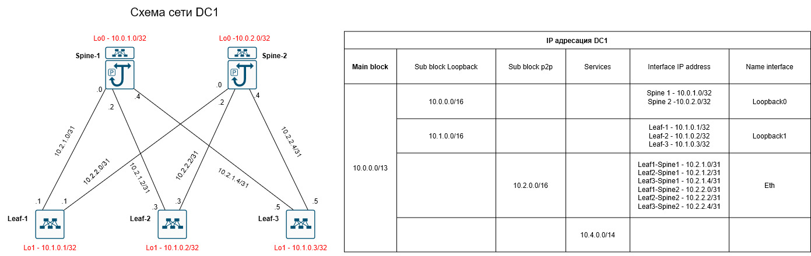
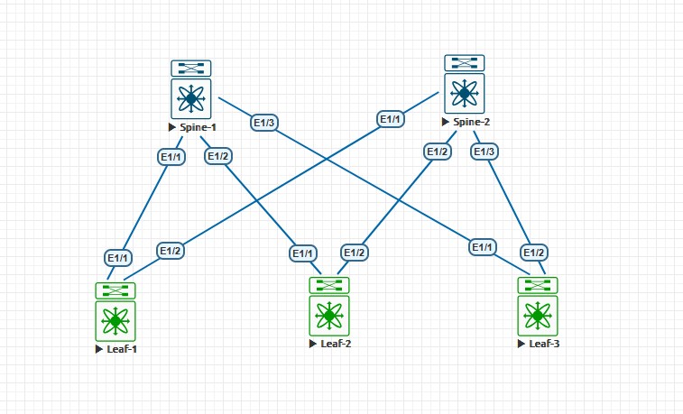

## Домашнее задание №3
### Схема сети и IP адресация

### Тестовый стенд

#### Net выбирался на основе Loopback интерфейсов

<details>
  <summary><b> Spine-1 </b></summary>
  <p> 

  ```
  interface Ethernet1/1
  no switchport
  ip address 10.2.1.0/31
  isis network point-to-point
  ip router isis 1
  ip ospf network point-to-point
  ip router ospf 1 area 0.0.0.0
  no shutdown

interface Ethernet1/2
  no switchport
  ip address 10.2.1.2/31
  isis network point-to-point
  ip router isis 1
  ip ospf network point-to-point
  ip router ospf 1 area 0.0.0.0
  no shutdown

interface Ethernet1/3
  no switchport
  ip address 10.2.1.4/31
  isis network point-to-point
  ip router isis 1
  ip ospf network point-to-point
  ip router ospf 1 area 0.0.0.0
  no shutdown

interface loopback0
  ip address 10.0.1.0/32
  ip router isis 1
  ip router ospf 1 area 0.0.0.0

  router isis 1
  net 49.0001.1001.0000.00
  is-type level-2
  ```
</p>
</details>

<details>
  <summary><b> Spine-2 </b></summary>
  <p> 

```
interface Ethernet1/1
  no switchport
  ip address 10.2.2.0/31
  isis network point-to-point
  ip router isis 1
  ip ospf network point-to-point
  ip router ospf 1 area 0.0.0.0
  no shutdown

interface Ethernet1/2
  no switchport
  ip address 10.2.2.2/31
  isis network point-to-point
  ip router isis 1
  ip ospf network point-to-point
  ip router ospf 1 area 0.0.0.0
  no shutdown

interface Ethernet1/3
  no switchport
  ip address 10.2.2.4/31
  isis network point-to-point
  ip router isis 1
  ip ospf network point-to-point
  ip router ospf 1 area 0.0.0.0
  no shutdown

interface loopback0
  ip address 10.0.2.0/32
  ip router isis 1
  ip router ospf 1 area 0.0.0.0

router isis 1
  net 49.0001.1002.0000.00
  is-type level-2

```
</p>
</details>

<details>
  <summary><b> Leaf-1 </b></summary>
  <p>

```
  interface Ethernet1/1
  no switchport
  ip address 10.2.1.1/31
  isis network point-to-point
  ip router isis 1
  ip ospf network point-to-point
  ip router ospf 1 area 0.0.0.0
  no shutdown

interface Ethernet1/2
  no switchport
  ip address 10.2.2.1/31
  isis network point-to-point
  ip router isis 1
  ip ospf network point-to-point
  ip router ospf 1 area 0.0.0.0
  no shutdown

  interface loopback1
  ip address 10.1.0.1/32
  ip router isis 1
  ip router ospf 1 area 0.0.0.0

  router isis 1
  net 49.0001.1010.1000.00
  is-type level-2
```
</p>
</details>

<details>
  <summary><b> Leaf-2 </b></summary>
  <p>
  
  ```
  interface Ethernet1/1
  no switchport
  ip address 10.2.1.3/31
  isis network point-to-point
  ip router isis 1
  ip ospf network point-to-point
  ip router ospf 1 area 0.0.0.0
  no shutdown

interface Ethernet1/2
  no switchport
  ip address 10.2.2.3/31
  isis network point-to-point
  ip router isis 1
  ip ospf network point-to-point
  ip router ospf 1 area 0.0.0.0
  no shutdown

interface loopback1
  ip address 10.1.0.2/32
  ip router isis 1
  ip router ospf 1 area 0.0.0.0

router isis 1
  net 49.0001.1010.2000.00
  is-type level-2
```
</p>
</details>

<details>
  <summary><b> Leaf-3 </b></summary>
  <p>

```
interface Ethernet1/1
  no switchport
  ip address 10.2.1.5/31
  isis network point-to-point
  ip router isis 1
  ip ospf network point-to-point
  ip router ospf 1 area 0.0.0.0
  no shutdown

interface Ethernet1/2
  no switchport
  ip address 10.2.2.5/31
  isis network point-to-point
  ip router isis 1
  ip ospf network point-to-point
  ip router ospf 1 area 0.0.0.0
  no shutdown

interface loopback1
  ip address 10.1.0.3/32
  ip router isis 1
  ip router ospf 1 area 0.0.0.0

router isis 1
  net 49.0001.1010.3000.00
  is-type level-2
```
</p>
</details>
