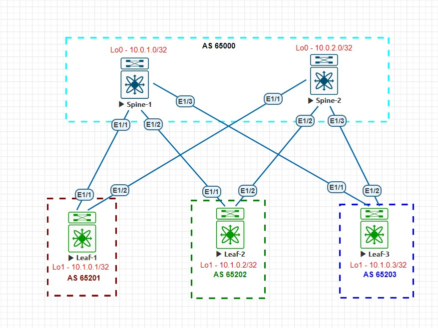

## Домашнее задание №4
### Схема сети и IP адресация

### Тестовый стенд

#### AS 65000 - для Spine коммутаторов
#### AS 65201-65299 для Leaf коммутаторов

#### Конфигурация коммутаторов
<details>
  <summary><b> Spine-1 </b></summary>
  <p> 
    
```
  route-map Leaf_AS permit 10
    match as-number 65201-65299 

  interface Ethernet1/1
  no switchport
  no ip redirects
  ip address 10.2.1.0/31
  no ipv6 redirects
  no shutdown

interface Ethernet1/2
  no switchport
  no ip redirects
  ip address 10.2.1.2/31
  no ipv6 redirects
  isis network point-to-point
  ip router isis 1
  ip ospf network point-to-point
  ip router ospf 1 area 0.0.0.0
  no shutdown

interface Ethernet1/3
  no switchport
  no ip redirects
  ip address 10.2.1.4/31
  no ipv6 redirects
  isis network point-to-point
  ip router isis 1
  ip ospf network point-to-point
  ip router ospf 1 area 0.0.0.0
  no shutdown

  interface loopback0
  ip address 10.0.1.0/32
  ip router ospf 1 area 0.0.0.0

  router bgp 65000
  router-id 10.0.1.0
  bestpath as-path multipath-relax
  address-family ipv4 unicast
    network 10.0.1.0/32
    maximum-paths 10
  template peer-policy DC1
    send-community
    send-community extended
  template peer-session Leaf
    timers 1 3
  neighbor 10.2.0.0/16 remote-as route-map Leaf_AS
    inherit peer DC1
    inherit peer-session Leaf
    address-family ipv4 unicast
```
    
  </p>
  </details>

<details>
  <summary><b> Spine-2 </b></summary>
  <p> 

```
route-map Leaf_AS permit 10
  match as-number 65201-65299


interface Ethernet1/1
  no switchport
  ip address 10.2.2.0/31
  isis network point-to-point
  ip router isis 1
  ip ospf network point-to-point
  ip router ospf 1 area 0.0.0.0
  no shutdown

interface Ethernet1/2
  no switchport
  ip address 10.2.2.2/31
  isis network point-to-point
  ip router isis 1
  ip ospf network point-to-point
  ip router ospf 1 area 0.0.0.0
  no shutdown

interface Ethernet1/3
  no switchport
  ip address 10.2.2.4/31
  isis network point-to-point
  ip router isis 1
  ip ospf network point-to-point
  ip router ospf 1 area 0.0.0.0
  no shutdown

interface loopback0
  ip address 10.0.2.0/32
  ip router isis 1
  ip router ospf 1 area 0.0.0.0

router bgp 65000
  router-id 10.0.2.0
  bestpath as-path multipath-relax
  address-family ipv4 unicast
    network 10.0.2.0/32
    maximum-paths 10
  template peer-policy DC1
    send-community
    send-community extended
  template peer-session Leaf
    timers 1 3
  neighbor 10.2.0.0/16 remote-as route-map Leaf_AS
    inherit peer DC1
    inherit peer-session Leaf
    address-family ipv4 unicast
```
</p>
  </details>

<details>
  <summary><b> Leaf-1 </b></summary>
  <p>

```
interface Ethernet1/1
  no switchport
  no ip redirects
  ip address 10.2.1.1/31
  no ipv6 redirects
  no shutdown

interface Ethernet1/2
  no switchport
  no ip redirects
  ip address 10.2.2.1/31
  no ipv6 redirects
  isis network point-to-point
  ip router isis 1
  ip ospf network point-to-point
  ip router ospf 1 area 0.0.0.0
  no shutdown

interface loopback1
  ip address 10.1.0.1/32

router bgp 65201
  router-id 10.1.0.1
  bestpath as-path multipath-relax
  address-family ipv4 unicast
    network 10.1.0.1/32
    maximum-paths 10
  template peer-policy DC1
    send-community
    send-community extended
  template peer-session Spine
    remote-as 65000
    timers 1 3
  neighbor 10.2.1.0
    inherit peer DC1
    inherit peer-session Spine
    address-family ipv4 unicast
  neighbor 10.2.2.0
    inherit peer DC1
    inherit peer-session Spine
    address-family ipv4 unicast
```
</p>
  </details>

<details>
  <summary><b> Leaf-2 </b></summary>
  <p>
  
  ```
interface Ethernet1/1
  no switchport
  ip address 10.2.1.3/31
  isis network point-to-point
  ip router isis 1
  ip ospf network point-to-point
  ip router ospf 1 area 0.0.0.0
  no shutdown

interface Ethernet1/2
  no switchport
  ip address 10.2.2.3/31
  isis network point-to-point
  ip router isis 1
  ip ospf network point-to-point
  ip router ospf 1 area 0.0.0.0
  no shutdown

interface loopback1
  ip address 10.1.0.2/32
  ip router isis 1
  ip router ospf 1 area 0.0.0.0

router bgp 65202
  router-id 10.1.0.2
  bestpath as-path multipath-relax
  address-family ipv4 unicast
    network 10.1.0.2/32
    maximum-paths 10
  template peer-policy DC1
    send-community
    send-community extended
  template peer-session Spine
    remote-as 65000
    timers 1 3
  neighbor 10.2.1.2
    inherit peer DC1
    inherit peer-session Spine
    address-family ipv4 unicast
  neighbor 10.2.2.2
    inherit peer DC1
    inherit peer-session Spine
    address-family ipv4 unicast
```
</p>
  </details>

<details>
  <summary><b> Leaf-3 </b></summary>
  <p>

```
interface Ethernet1/1
  no switchport
  ip address 10.2.1.5/31
  isis network point-to-point
  ip router isis 1
  ip ospf network point-to-point
  ip router ospf 1 area 0.0.0.0
  no shutdown

interface Ethernet1/2
  no switchport
  ip address 10.2.2.5/31
  isis network point-to-point
  ip router isis 1
  ip ospf network point-to-point
  ip router ospf 1 area 0.0.0.0
  no shutdown

interface loopback1
  ip address 10.1.0.3/32
  ip router isis 1
  ip router ospf 1 area 0.0.0.0

router bgp 65203
  router-id 10.1.0.3
  bestpath as-path multipath-relax
  address-family ipv4 unicast
    network 10.1.0.3/32
    maximum-paths 10
  template peer-policy DC1
    send-community
    send-community extended
  template peer-session Spine
    remote-as 65000
    timers 1 3
  neighbor 10.2.1.4
    inherit peer DC1
    inherit peer-session Spine
    address-family ipv4 unicast
  neighbor 10.2.2.4
    inherit peer DC1
    inherit peer-session Spine
    address-family ipv4 unicast
```
</p>
  </details>

#### Соседи Spine-1

```
Spine-1# sh bgp sessions 
Total peers 3, established peers 3
ASN 65000
VRF default, local ASN 65000
peers 3, established peers 3, local router-id 10.0.1.0
State: I-Idle, A-Active, O-Open, E-Established, C-Closing, S-Shutdown

Neighbor        ASN    Flaps LastUpDn|LastRead|LastWrit St Port(L/R)  Notif(S/R)
10.2.1.1        65201 0     05:17:58|00:00:02|00:00:02 E   179/30598      0/0
10.2.1.3        65202 0     05:05:40|0.951932|0.050079 E   179/40336      0/0
10.2.1.5        65203 0     05:03:39|0.859280|0.425066 E   179/15980      0/0
```

#### Соседи Spine-2
```
Spine-2# sh bgp sessions
Total peers 3, established peers 3
ASN 65000
VRF default, local ASN 65000
peers 3, established peers 3, local router-id 10.0.2.0
State: I-Idle, A-Active, O-Open, E-Established, C-Closing, S-Shutdown

Neighbor        ASN    Flaps LastUpDn|LastRead|LastWrit St Port(L/R)  Notif(S/R)
10.2.2.1        65201 0     05:11:28|0.757820|0.015021 E   179/33930      0/0
10.2.2.3        65202 0     05:07:49|0.940525|0.883308 E   179/22184      0/0
10.2.2.5        65203 0     05:05:50|0.598996|0.603728 E   179/36788      0/0
```

#### Таблица маршрутизации Leaf-1
```
Leaf-1# sh ip route
IP Route Table for VRF "default"
'*' denotes best ucast next-hop
'**' denotes best mcast next-hop
'[x/y]' denotes [preference/metric]
'%<string>' in via output denotes VRF <string>

10.0.1.0/32, ubest/mbest: 1/0
    *via 10.2.1.0, [20/0], 05:21:16, bgp-65201, external, tag 65000
10.0.2.0/32, ubest/mbest: 1/0
    *via 10.2.2.0, [20/0], 05:12:37, bgp-65201, external, tag 65000
10.1.0.1/32, ubest/mbest: 2/0, attached
    *via 10.1.0.1, Lo1, [0/0], 05:46:55, local
    *via 10.1.0.1, Lo1, [0/0], 05:46:55, direct
10.1.0.2/32, ubest/mbest: 2/0
    *via 10.2.1.0, [20/0], 05:08:58, bgp-65201, external, tag 65000
    *via 10.2.2.0, [20/0], 05:08:58, bgp-65201, external, tag 65000
10.1.0.3/32, ubest/mbest: 2/0
    *via 10.2.1.0, [20/0], 05:06:57, bgp-65201, external, tag 65000
    *via 10.2.2.0, [20/0], 05:06:57, bgp-65201, external, tag 65000
10.2.1.0/31, ubest/mbest: 1/0, attached
    *via 10.2.1.1, Eth1/1, [0/0], 05:45:49, direct
10.2.1.1/32, ubest/mbest: 1/0, attached
    *via 10.2.1.1, Eth1/1, [0/0], 05:45:49, local
10.2.2.0/31, ubest/mbest: 1/0, attached
    *via 10.2.2.1, Eth1/2, [0/0], 05:45:48, direct
10.2.2.1/32, ubest/mbest: 1/0, attached
    *via 10.2.2.1, Eth1/2, [0/0], 05:45:48, local
```

#### Таблица маршрутизации Leaf-2
```
Leaf-2# sh ip route
IP Route Table for VRF "default"
'*' denotes best ucast next-hop
'**' denotes best mcast next-hop
'[x/y]' denotes [preference/metric]
'%<string>' in via output denotes VRF <string>

10.0.1.0/32, ubest/mbest: 1/0
    *via 10.2.1.2, [20/0], 05:09:56, bgp-65202, external, tag 65000
10.0.2.0/32, ubest/mbest: 1/0
    *via 10.2.2.2, [20/0], 05:09:55, bgp-65202, external, tag 65000
10.1.0.1/32, ubest/mbest: 2/0
    *via 10.2.1.2, [20/0], 05:09:56, bgp-65202, external, tag 65000
    *via 10.2.2.2, [20/0], 05:09:55, bgp-65202, external, tag 65000
10.1.0.2/32, ubest/mbest: 2/0, attached
    *via 10.1.0.2, Lo1, [0/0], 05:17:56, local
    *via 10.1.0.2, Lo1, [0/0], 05:17:56, direct
10.1.0.3/32, ubest/mbest: 2/0
    *via 10.2.1.2, [20/0], 05:07:54, bgp-65202, external, tag 65000
    *via 10.2.2.2, [20/0], 05:07:54, bgp-65202, external, tag 65000
10.2.1.2/31, ubest/mbest: 1/0, attached
    *via 10.2.1.3, Eth1/1, [0/0], 05:16:47, direct
10.2.1.3/32, ubest/mbest: 1/0, attached
    *via 10.2.1.3, Eth1/1, [0/0], 05:16:47, local
10.2.2.2/31, ubest/mbest: 1/0, attached
    *via 10.2.2.3, Eth1/2, [0/0], 05:16:47, direct
10.2.2.3/32, ubest/mbest: 1/0, attached
    *via 10.2.2.3, Eth1/2, [0/0], 05:16:47, local
```

#### Таблица маршрутизации Leaf-3
```
Leaf-3# sh ip route
IP Route Table for VRF "default"
'*' denotes best ucast next-hop
'**' denotes best mcast next-hop
'[x/y]' denotes [preference/metric]
'%<string>' in via output denotes VRF <string>

10.0.1.0/32, ubest/mbest: 1/0
    *via 10.2.1.4, [20/0], 05:08:28, bgp-65203, external, tag 65000
10.0.2.0/32, ubest/mbest: 1/0
    *via 10.2.2.4, [20/0], 05:08:28, bgp-65203, external, tag 65000
10.1.0.1/32, ubest/mbest: 2/0
    *via 10.2.1.4, [20/0], 05:08:28, bgp-65203, external, tag 65000
    *via 10.2.2.4, [20/0], 05:08:28, bgp-65203, external, tag 65000
10.1.0.2/32, ubest/mbest: 2/0
    *via 10.2.1.4, [20/0], 05:08:28, bgp-65203, external, tag 65000
    *via 10.2.2.4, [20/0], 05:08:28, bgp-65203, external, tag 65000
10.1.0.3/32, ubest/mbest: 2/0, attached
    *via 10.1.0.3, Lo1, [0/0], 05:12:31, local
    *via 10.1.0.3, Lo1, [0/0], 05:12:31, direct
10.2.1.4/31, ubest/mbest: 1/0, attached
    *via 10.2.1.5, Eth1/1, [0/0], 05:11:18, direct
10.2.1.5/32, ubest/mbest: 1/0, attached
    *via 10.2.1.5, Eth1/1, [0/0], 05:11:18, local
10.2.2.4/31, ubest/mbest: 1/0, attached
    *via 10.2.2.5, Eth1/2, [0/0], 05:11:18, direct
10.2.2.5/32, ubest/mbest: 1/0, attached
    *via 10.2.2.5, Eth1/2, [0/0], 05:11:18, local
```

#### Проверка доступности всех Loopback интерфейсов

```
Leaf-1# ping 10.0.1.0 source 10.1.0.1
PING 10.0.1.0 (10.0.1.0) from 10.1.0.1: 56 data bytes
64 bytes from 10.0.1.0: icmp_seq=0 ttl=254 time=2.997 ms
64 bytes from 10.0.1.0: icmp_seq=1 ttl=254 time=1.163 ms
64 bytes from 10.0.1.0: icmp_seq=2 ttl=254 time=0.931 ms
64 bytes from 10.0.1.0: icmp_seq=3 ttl=254 time=1.067 ms
64 bytes from 10.0.1.0: icmp_seq=4 ttl=254 time=1.115 ms

--- 10.0.1.0 ping statistics ---
5 packets transmitted, 5 packets received, 0.00% packet loss
round-trip min/avg/max = 0.931/1.454/2.997 ms
Leaf-1# ping 10.0.2.0 source 10.1.0.1
PING 10.0.2.0 (10.0.2.0) from 10.1.0.1: 56 data bytes
64 bytes from 10.0.2.0: icmp_seq=0 ttl=254 time=3.783 ms
64 bytes from 10.0.2.0: icmp_seq=1 ttl=254 time=1.967 ms
64 bytes from 10.0.2.0: icmp_seq=2 ttl=254 time=1.981 ms
64 bytes from 10.0.2.0: icmp_seq=3 ttl=254 time=1.891 ms
64 bytes from 10.0.2.0: icmp_seq=4 ttl=254 time=1.874 ms

--- 10.0.2.0 ping statistics ---
5 packets transmitted, 5 packets received, 0.00% packet loss
round-trip min/avg/max = 1.874/2.299/3.783 ms
Leaf-1# ping 10.1.0.2 source 10.1.0.1
PING 10.1.0.2 (10.1.0.2) from 10.1.0.1: 56 data bytes
64 bytes from 10.1.0.2: icmp_seq=0 ttl=253 time=17.764 ms
64 bytes from 10.1.0.2: icmp_seq=1 ttl=253 time=5.295 ms
64 bytes from 10.1.0.2: icmp_seq=2 ttl=253 time=4.296 ms
64 bytes from 10.1.0.2: icmp_seq=3 ttl=253 time=3.304 ms
64 bytes from 10.1.0.2: icmp_seq=4 ttl=253 time=2.942 ms

--- 10.1.0.2 ping statistics ---
5 packets transmitted, 5 packets received, 0.00% packet loss
round-trip min/avg/max = 2.942/6.72/17.764 ms
Leaf-1# ping 10.1.0.3 source 10.1.0.1
PING 10.1.0.3 (10.1.0.3) from 10.1.0.1: 56 data bytes
64 bytes from 10.1.0.3: icmp_seq=0 ttl=253 time=4.597 ms
64 bytes from 10.1.0.3: icmp_seq=1 ttl=253 time=3.053 ms
64 bytes from 10.1.0.3: icmp_seq=2 ttl=253 time=2.551 ms
64 bytes from 10.1.0.3: icmp_seq=3 ttl=253 time=1.941 ms
64 bytes from 10.1.0.3: icmp_seq=4 ttl=253 time=2.497 ms

--- 10.1.0.3 ping statistics ---
5 packets transmitted, 5 packets received, 0.00% packet loss
round-trip min/avg/max = 1.941/2.927/4.597 ms
```
