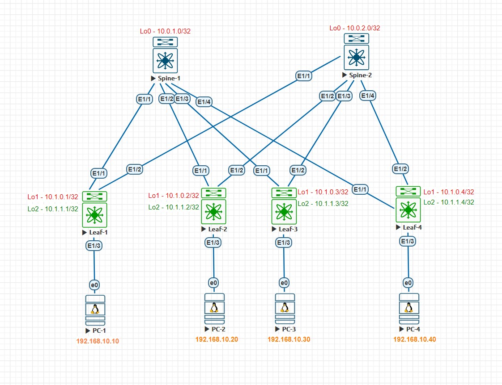
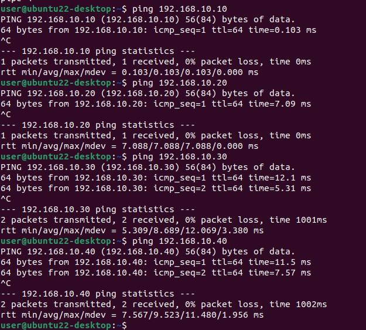

## Домашнее задание №5
### IP адресация

### Тестовый стенд


#### Underlay и Overlay построен на iBGP AS 65000

#### Конфигурация коммутаторов
<details>
  <summary><b> Spine-1 </b></summary>
  <p> 
    
```
nv overlay evpn
feature ospf
feature bgp
feature isis
feature bfd

interface Ethernet1/1
  no switchport
  no ip redirects
  ip address 10.2.1.0/31
  no ipv6 redirects
  no shutdown

interface Ethernet1/2
  no switchport
  no ip redirects
  ip address 10.2.1.2/31
  no ipv6 redirects
  no shutdown

interface Ethernet1/3
  no switchport
  no ip redirects
  ip address 10.2.1.4/31
  no ipv6 redirects
  no shutdown

interface Ethernet1/4
  no switchport
  no ip redirects
  ip address 10.2.1.6/31
  no ipv6 redirects
  no shutdown

interface loopback0
  ip address 10.0.1.0/32

router bgp 65000
  router-id 10.0.1.0
  address-family ipv4 unicast
    network 10.0.1.0/32
    maximum-paths 10
  address-family l2vpn evpn
    maximum-paths 10
    maximum-paths ibgp 64
  template peer LEAF
    remote-as 65000
    update-source loopback0
    timers 3 9
    address-family l2vpn evpn
      send-community
      send-community extended
      route-reflector-client
  template peer-policy DC
    send-community
    send-community extended
    route-reflector-client
    next-hop-self all
  template peer-session DC
    remote-as 65000
    timers 3 9
  neighbor 10.1.0.1
    inherit peer LEAF
  neighbor 10.1.0.2
    inherit peer LEAF
  neighbor 10.1.0.3
    inherit peer LEAF
  neighbor 10.1.0.4
    inherit peer LEAF
  neighbor 10.2.0.0/16
    inherit peer DC
    inherit peer-session DC
    address-family ipv4 unicast
      route-reflector-client
      next-hop-self all
```
</p>
  </details>

  <details>
  <summary><b> Spine-2 </b></summary>
  <p> 

```

nv overlay evpn
feature ospf
feature bgp
feature isis

interface Ethernet1/1
  no switchport
  no ip redirects
  ip address 10.2.2.0/31
  no ipv6 redirects
  no shutdown

interface Ethernet1/2
  no switchport
  no ip redirects
  ip address 10.2.2.2/31
  no ipv6 redirects
  no shutdown

interface Ethernet1/3
  no switchport
  no ip redirects
  ip address 10.2.2.4/31
  no ipv6 redirects
  no shutdown

interface Ethernet1/4
  no switchport
  no ip redirects
  ip address 10.2.2.6/31
  no ipv6 redirects
  no shutdown

interface loopback0
  ip address 10.0.2.0/32

router bgp 65000
  router-id 10.0.2.0
  address-family ipv4 unicast
    network 10.0.2.0/32
    maximum-paths 10
  address-family l2vpn evpn
    maximum-paths 10
    maximum-paths ibgp 64
  template peer LEAF
    remote-as 65000
    update-source loopback0
    timers 3 9
    address-family l2vpn evpn
      send-community
      send-community extended
      route-reflector-client
  template peer-policy DC
    send-community
    send-community extended
    route-reflector-client
    next-hop-self all
  template peer-session DC
    remote-as 65000
    timers 3 9
  neighbor 10.1.0.1
    inherit peer LEAF
  neighbor 10.1.0.2
    inherit peer LEAF
  neighbor 10.1.0.3
    inherit peer LEAF
  neighbor 10.1.0.4
    inherit peer LEAF
  neighbor 10.2.0.0/16
    inherit peer DC
    inherit peer-session DC
    address-family ipv4 unicast
      route-reflector-client
      next-hop-self all
```
</p>
  </details>

<details>
  <summary><b> Leaf-1 </b></summary>
  <p>

```

nv overlay evpn
feature ospf
feature bgp
feature isis
feature vn-segment-vlan-based
feature bfd
feature nv overlay

vlan 1,10
vlan 10
  name SERVICE_1
  vn-segment 10010

interface nve1
  no shutdown
  host-reachability protocol bgp
  source-interface loopback1
  member vni 10010
    ingress-replication protocol bgp

interface Ethernet1/1
  no switchport
  no ip redirects
  ip address 10.2.1.1/31
  no ipv6 redirects
  no shutdown

interface Ethernet1/2
  no switchport
  no ip redirects
  ip address 10.2.2.1/31
  no ipv6 redirects
  no shutdown

interface Ethernet1/3
  switchport access vlan 10

interface loopback1
  ip address 10.1.0.1/32

interface loopback2
  ip address 10.1.1.1/32

router bgp 65000
  router-id 10.1.0.1
  address-family ipv4 unicast
    network 10.1.0.1/32
    network 10.1.1.1/32
    maximum-paths 10
    maximum-paths ibgp 64
  address-family l2vpn evpn
    maximum-paths 10
    maximum-paths ibgp 64
  template peer SPINE
    remote-as 65000
    update-source loopback1
    timers 3 9
    address-family l2vpn evpn
      send-community
      send-community extended
  template peer-policy DC
    send-community
    send-community extended
  template peer-session DC
    remote-as 65000
    timers 3 9
  neighbor 10.0.1.0
    inherit peer SPINE
  neighbor 10.0.2.0
    inherit peer SPINE
  neighbor 10.2.1.0
    inherit peer DC
    inherit peer-session DC
    address-family ipv4 unicast
      no next-hop-self
  neighbor 10.2.2.0
    inherit peer DC
    inherit peer-session DC
    address-family ipv4 unicast
      no next-hop-self
evpn
  vni 10010 l2
    rd auto
    route-target import auto
    route-target export auto
```
</p>
  </details>

<details>
  <summary><b> Leaf-2 </b></summary>
  <p>

```

nv overlay evpn
feature ospf
feature bgp
feature isis
feature vn-segment-vlan-based
feature nv overlay

vlan 1,10
vlan 10
  name SERVICE_1
  vn-segment 10010

interface nve1
  no shutdown
  host-reachability protocol bgp
  source-interface loopback1
  member vni 10010
    ingress-replication protocol bgp

interface Ethernet1/1
  no switchport
  no ip redirects
  ip address 10.2.1.3/31
  no ipv6 redirects
  no shutdown

interface Ethernet1/2
  no switchport
  no ip redirects
  ip address 10.2.2.3/31
  no ipv6 redirects
  no shutdown

interface Ethernet1/3
  switchport access vlan 10

interface loopback1
  ip address 10.1.0.2/32

interface loopback2
  ip address 10.1.1.2/32

router bgp 65000
  router-id 10.1.0.2
  address-family ipv4 unicast
    network 10.1.0.2/32
    network 10.1.1.2/32
    maximum-paths 10
    maximum-paths ibgp 64
  address-family l2vpn evpn
    maximum-paths 10
    maximum-paths ibgp 64
  template peer SPINE
    remote-as 65000
    update-source loopback1
    timers 3 9
    address-family l2vpn evpn
      send-community
      send-community extended
  template peer-policy DC
    send-community
    send-community extended
  template peer-session DC
    remote-as 65000
    timers 3 9
  neighbor 10.0.1.0
    inherit peer SPINE
  neighbor 10.0.2.0
    inherit peer SPINE
  neighbor 10.2.1.2
    inherit peer DC
    inherit peer-session DC
    address-family ipv4 unicast
      no next-hop-self
  neighbor 10.2.2.2
    inherit peer DC
    inherit peer-session DC
    address-family ipv4 unicast
      no next-hop-self
evpn
  vni 10010 l2
    rd auto
    route-target import auto
    route-target export auto
```
</p>
  </details>

<details>
  <summary><b> Leaf-3 </b></summary>
  <p>
    
```

nv overlay evpn
feature ospf
feature bgp
feature isis
feature vn-segment-vlan-based
feature nv overlay

vlan 1,10
vlan 10
  name SERVICE_1
  vn-segment 10010

interface nve1
  no shutdown
  host-reachability protocol bgp
  source-interface loopback1
  member vni 10010
    ingress-replication protocol bgp

interface Ethernet1/1
  no switchport
  no ip redirects
  ip address 10.2.1.5/31
  no ipv6 redirects
  no shutdown

interface Ethernet1/2
  no switchport
  no ip redirects
  ip address 10.2.2.5/31
  no ipv6 redirects
  no shutdown

interface Ethernet1/3
  switchport access vlan 10

interface loopback1
  ip address 10.1.0.3/32

interface loopback2
  ip address 10.1.1.3/32

router bgp 65000
  router-id 10.1.0.3
  address-family ipv4 unicast
    network 10.1.0.3/32
    network 10.1.1.3/32
    maximum-paths 10
    maximum-paths ibgp 64
  address-family l2vpn evpn
    maximum-paths 10
    maximum-paths ibgp 64
  template peer SPINE
    remote-as 65000
    update-source loopback1
    timers 3 9
    address-family l2vpn evpn
      send-community
      send-community extended
  template peer-policy DC
    send-community
    send-community extended
  template peer-session DC
    remote-as 65000
    timers 3 9
  neighbor 10.0.1.0
    inherit peer SPINE
  neighbor 10.0.2.0
    inherit peer SPINE
  neighbor 10.2.1.4
    inherit peer DC
    inherit peer-session DC
    address-family ipv4 unicast
  neighbor 10.2.2.4
    inherit peer DC
    inherit peer-session DC
    address-family ipv4 unicast
evpn
  vni 10010 l2
    rd auto
    route-target import auto
    route-target export auto
```
</p>
  </details>

<details>
  <summary><b> Leaf-4 </b></summary>
  <p>

```

nv overlay evpn
feature ospf
feature bgp
feature isis
feature vn-segment-vlan-based
feature nv overlay

vlan 1,10
vlan 10
  name SERVICE_1
  vn-segment 10010

interface nve1
  no shutdown
  host-reachability protocol bgp
  source-interface loopback1
  member vni 10010
    ingress-replication protocol bgp

interface Ethernet1/1
  no switchport
  no ip redirects
  ip address 10.2.1.7/31
  no ipv6 redirects
  no shutdown

interface Ethernet1/2
  no switchport
  no ip redirects
  ip address 10.2.2.7/31
  no ipv6 redirects
  no shutdown

interface Ethernet1/3
  switchport access vlan 10

interface loopback1
  ip address 10.1.0.4/32

interface loopback2
  ip address 10.1.1.4/32

router bgp 65000
  router-id 10.1.0.4
  address-family ipv4 unicast
    network 10.1.0.4/32
    network 10.1.1.4/32
    maximum-paths 10
    maximum-paths ibgp 64
  address-family l2vpn evpn
    maximum-paths 10
    maximum-paths ibgp 64
  template peer SPINE
    remote-as 65000
    update-source loopback1
    timers 3 9
    address-family l2vpn evpn
      send-community
      send-community extended
  template peer-policy DC
    send-community
    send-community extended
  template peer-session DC
    remote-as 65000
    timers 3 9
  neighbor 10.0.1.0
    inherit peer SPINE
  neighbor 10.0.2.0
    inherit peer SPINE
  neighbor 10.2.1.6
    inherit peer DC
    inherit peer-session DC
    address-family ipv4 unicast
  neighbor 10.2.2.6
    inherit peer DC
    inherit peer-session DC
    address-family ipv4 unicast
evpn
  vni 10010 l2
    rd auto
    route-target import auto
    route-target export auto
```
</p>
  </details>

#### Проверка работы L2EVPN

<details>
  <summary><b> Вывод таблицы маршрутизаци l2vpn с Leaf коммутаторов </b></summary>
  <p>

```
Leaf-1# sh bgp l2vpn evpn 
BGP routing table information for VRF default, address family L2VPN EVPN
BGP table version is 78, Local Router ID is 10.1.0.1
Status: s-suppressed, x-deleted, S-stale, d-dampened, h-history, *-valid, >-best
Path type: i-internal, e-external, c-confed, l-local, a-aggregate, r-redist, I-i
njected
Origin codes: i - IGP, e - EGP, ? - incomplete, | - multipath, & - backup, 2 - b
est2

   Network            Next Hop            Metric     LocPrf     Weight Path
Route Distinguisher: 10.1.0.1:32777    (L2VNI 10010)
*>l[2]:[0]:[0]:[48]:[0050.0000.0700]:[0]:[0.0.0.0]/216
                      10.1.0.1                          100      32768 i
*>i[2]:[0]:[0]:[48]:[0050.0000.0800]:[0]:[0.0.0.0]/216
                      10.1.0.3                          100          0 i
*>i[2]:[0]:[0]:[48]:[0050.0000.0a00]:[0]:[0.0.0.0]/216
                      10.1.0.2                          100          0 i
*>i[2]:[0]:[0]:[48]:[0050.0000.0b00]:[0]:[0.0.0.0]/216
                      10.1.0.4                          100          0 i
*>l[3]:[0]:[32]:[10.1.0.1]/88
                      10.1.0.1                          100      32768 i
*>i[3]:[0]:[32]:[10.1.0.2]/88
                      10.1.0.2                          100          0 i
*>i[3]:[0]:[32]:[10.1.0.3]/88
                      10.1.0.3                          100          0 i
*>i[3]:[0]:[32]:[10.1.0.4]/88
                      10.1.0.4                          100          0 i

Route Distinguisher: 10.1.0.2:32777
* i[2]:[0]:[0]:[48]:[0050.0000.0a00]:[0]:[0.0.0.0]/216
                      10.1.0.2                          100          0 i
*>i                   10.1.0.2                          100          0 i
*>i[3]:[0]:[32]:[10.1.0.2]/88
                      10.1.0.2                          100          0 i
* i                   10.1.0.2                          100          0 i

Route Distinguisher: 10.1.0.3:32777
* i[2]:[0]:[0]:[48]:[0050.0000.0800]:[0]:[0.0.0.0]/216
                      10.1.0.3                          100          0 i
*>i                   10.1.0.3                          100          0 i
*>i[3]:[0]:[32]:[10.1.0.3]/88
                      10.1.0.3                          100          0 i
* i                   10.1.0.3                          100          0 i

Route Distinguisher: 10.1.0.4:32777
*>i[2]:[0]:[0]:[48]:[0050.0000.0b00]:[0]:[0.0.0.0]/216
                      10.1.0.4                          100          0 i
* i                   10.1.0.4                          100          0 i
* i[3]:[0]:[32]:[10.1.0.4]/88
                      10.1.0.4                          100          0 i
*>i                   10.1.0.4                          100          0 i


Leaf-2#  sh bgp l2vpn evpn
BGP routing table information for VRF default, address family L2VPN EVPN
BGP table version is 88, Local Router ID is 10.1.0.2
Status: s-suppressed, x-deleted, S-stale, d-dampened, h-history, *-valid, >-best
Path type: i-internal, e-external, c-confed, l-local, a-aggregate, r-redist, I-i
njected
Origin codes: i - IGP, e - EGP, ? - incomplete, | - multipath, & - backup, 2 - b
est2

   Network            Next Hop            Metric     LocPrf     Weight Path
Route Distinguisher: 10.1.0.1:32777
*>i[2]:[0]:[0]:[48]:[0050.0000.0700]:[0]:[0.0.0.0]/216
                      10.1.0.1                          100          0 i
* i                   10.1.0.1                          100          0 i
*>i[3]:[0]:[32]:[10.1.0.1]/88
                      10.1.0.1                          100          0 i
* i                   10.1.0.1                          100          0 i

Route Distinguisher: 10.1.0.2:32777    (L2VNI 10010)
*>i[2]:[0]:[0]:[48]:[0050.0000.0700]:[0]:[0.0.0.0]/216
                      10.1.0.1                          100          0 i
*>i[2]:[0]:[0]:[48]:[0050.0000.0800]:[0]:[0.0.0.0]/216
                      10.1.0.3                          100          0 i
*>l[2]:[0]:[0]:[48]:[0050.0000.0a00]:[0]:[0.0.0.0]/216
                      10.1.0.2                          100      32768 i
*>i[2]:[0]:[0]:[48]:[0050.0000.0b00]:[0]:[0.0.0.0]/216
                      10.1.0.4                          100          0 i
*>i[3]:[0]:[32]:[10.1.0.1]/88
                      10.1.0.1                          100          0 i
*>l[3]:[0]:[32]:[10.1.0.2]/88
                      10.1.0.2                          100      32768 i
*>i[3]:[0]:[32]:[10.1.0.3]/88
                      10.1.0.3                          100          0 i
*>i[3]:[0]:[32]:[10.1.0.4]/88
                      10.1.0.4                          100          0 i

Route Distinguisher: 10.1.0.3:32777
* i[2]:[0]:[0]:[48]:[0050.0000.0800]:[0]:[0.0.0.0]/216
                      10.1.0.3                          100          0 i
*>i                   10.1.0.3                          100          0 i
*>i[3]:[0]:[32]:[10.1.0.3]/88
                      10.1.0.3                          100          0 i
* i                   10.1.0.3                          100          0 i

Route Distinguisher: 10.1.0.4:32777
*>i[2]:[0]:[0]:[48]:[0050.0000.0b00]:[0]:[0.0.0.0]/216
                      10.1.0.4                          100          0 i
* i                   10.1.0.4                          100          0 i
* i[3]:[0]:[32]:[10.1.0.4]/88
                      10.1.0.4                          100          0 i
*>i                   10.1.0.4                          100          0 i

Leaf-3#  sh bgp l2vpn evpn
BGP routing table information for VRF default, address family L2VPN EVPN
BGP table version is 80, Local Router ID is 10.1.0.3
Status: s-suppressed, x-deleted, S-stale, d-dampened, h-history, *-valid, >-best
Path type: i-internal, e-external, c-confed, l-local, a-aggregate, r-redist, I-i
njected
Origin codes: i - IGP, e - EGP, ? - incomplete, | - multipath, & - backup, 2 - b
est2

   Network            Next Hop            Metric     LocPrf     Weight Path
Route Distinguisher: 10.1.0.1:32777
*>i[2]:[0]:[0]:[48]:[0050.0000.0700]:[0]:[0.0.0.0]/216
                      10.1.0.1                          100          0 i
* i                   10.1.0.1                          100          0 i
*>i[3]:[0]:[32]:[10.1.0.1]/88
                      10.1.0.1                          100          0 i
* i                   10.1.0.1                          100          0 i

Route Distinguisher: 10.1.0.2:32777
* i[2]:[0]:[0]:[48]:[0050.0000.0a00]:[0]:[0.0.0.0]/216
                      10.1.0.2                          100          0 i
*>i                   10.1.0.2                          100          0 i
*>i[3]:[0]:[32]:[10.1.0.2]/88
                      10.1.0.2                          100          0 i
* i                   10.1.0.2                          100          0 i

Route Distinguisher: 10.1.0.3:32777    (L2VNI 10010)
*>i[2]:[0]:[0]:[48]:[0050.0000.0700]:[0]:[0.0.0.0]/216
                      10.1.0.1                          100          0 i
*>l[2]:[0]:[0]:[48]:[0050.0000.0800]:[0]:[0.0.0.0]/216
                      10.1.0.3                          100      32768 i
*>i[2]:[0]:[0]:[48]:[0050.0000.0a00]:[0]:[0.0.0.0]/216
                      10.1.0.2                          100          0 i
*>i[2]:[0]:[0]:[48]:[0050.0000.0b00]:[0]:[0.0.0.0]/216
                      10.1.0.4                          100          0 i
*>i[3]:[0]:[32]:[10.1.0.1]/88
                      10.1.0.1                          100          0 i
*>i[3]:[0]:[32]:[10.1.0.2]/88
                      10.1.0.2                          100          0 i
*>l[3]:[0]:[32]:[10.1.0.3]/88
                      10.1.0.3                          100      32768 i
*>i[3]:[0]:[32]:[10.1.0.4]/88
                      10.1.0.4                          100          0 i

Route Distinguisher: 10.1.0.4:32777
*>i[2]:[0]:[0]:[48]:[0050.0000.0b00]:[0]:[0.0.0.0]/216
                      10.1.0.4                          100          0 i
* i                   10.1.0.4                          100          0 i
* i[3]:[0]:[32]:[10.1.0.4]/88
                      10.1.0.4                          100          0 i
*>i                   10.1.0.4                          100          0 i

Leaf-4# sh bgp l2vpn evpn
BGP routing table information for VRF default, address family L2VPN EVPN
BGP table version is 76, Local Router ID is 10.1.0.4
Status: s-suppressed, x-deleted, S-stale, d-dampened, h-history, *-valid, >-best
Path type: i-internal, e-external, c-confed, l-local, a-aggregate, r-redist, I-i
njected
Origin codes: i - IGP, e - EGP, ? - incomplete, | - multipath, & - backup, 2 - b
est2

   Network            Next Hop            Metric     LocPrf     Weight Path
Route Distinguisher: 10.1.0.1:32777
*>i[2]:[0]:[0]:[48]:[0050.0000.0700]:[0]:[0.0.0.0]/216
                      10.1.0.1                          100          0 i
* i                   10.1.0.1                          100          0 i
*>i[3]:[0]:[32]:[10.1.0.1]/88
                      10.1.0.1                          100          0 i
* i                   10.1.0.1                          100          0 i

Route Distinguisher: 10.1.0.2:32777
* i[2]:[0]:[0]:[48]:[0050.0000.0a00]:[0]:[0.0.0.0]/216
                      10.1.0.2                          100          0 i
*>i                   10.1.0.2                          100          0 i
*>i[3]:[0]:[32]:[10.1.0.2]/88
                      10.1.0.2                          100          0 i
* i                   10.1.0.2                          100          0 i

Route Distinguisher: 10.1.0.3:32777
* i[2]:[0]:[0]:[48]:[0050.0000.0800]:[0]:[0.0.0.0]/216
                      10.1.0.3                          100          0 i
*>i                   10.1.0.3                          100          0 i
*>i[3]:[0]:[32]:[10.1.0.3]/88
                      10.1.0.3                          100          0 i
* i                   10.1.0.3                          100          0 i

Route Distinguisher: 10.1.0.4:32777    (L2VNI 10010)
*>i[2]:[0]:[0]:[48]:[0050.0000.0700]:[0]:[0.0.0.0]/216
                      10.1.0.1                          100          0 i
*>i[2]:[0]:[0]:[48]:[0050.0000.0800]:[0]:[0.0.0.0]/216
                      10.1.0.3                          100          0 i
*>i[2]:[0]:[0]:[48]:[0050.0000.0a00]:[0]:[0.0.0.0]/216
                      10.1.0.2                          100          0 i
*>l[2]:[0]:[0]:[48]:[0050.0000.0b00]:[0]:[0.0.0.0]/216
                      10.1.0.4                          100      32768 i
*>i[3]:[0]:[32]:[10.1.0.1]/88
                      10.1.0.1                          100          0 i
*>i[3]:[0]:[32]:[10.1.0.2]/88
                      10.1.0.2                          100          0 i
*>i[3]:[0]:[32]:[10.1.0.3]/88
                      10.1.0.3                          100          0 i
*>l[3]:[0]:[32]:[10.1.0.4]/88
                      10.1.0.4                          100      32768 i
```
</p>
  </details>

##### Проверка доступности хостов с PC-1


##### Проверка доступности хостов с PC-2


##### Проверка доступности хостов с PC-3


##### Проверка доступности хостов с PC-4

