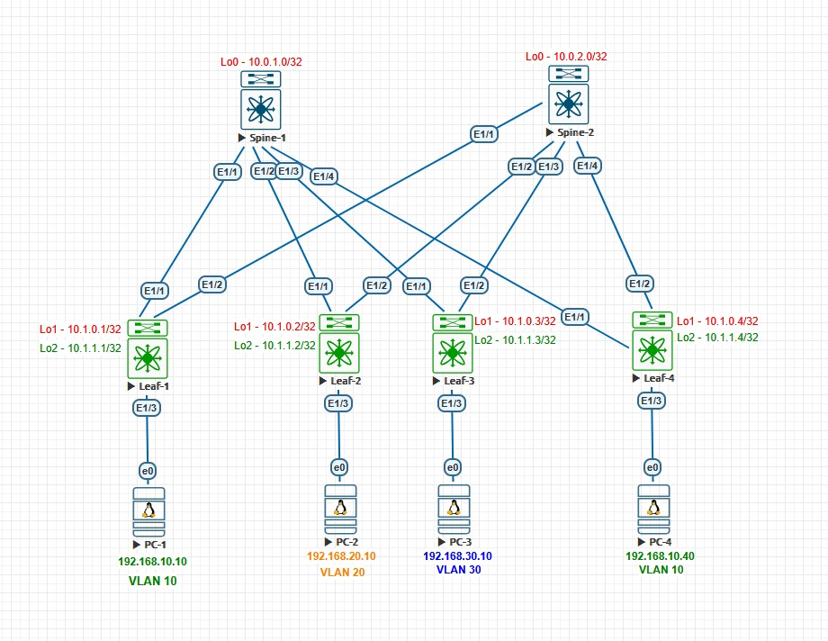
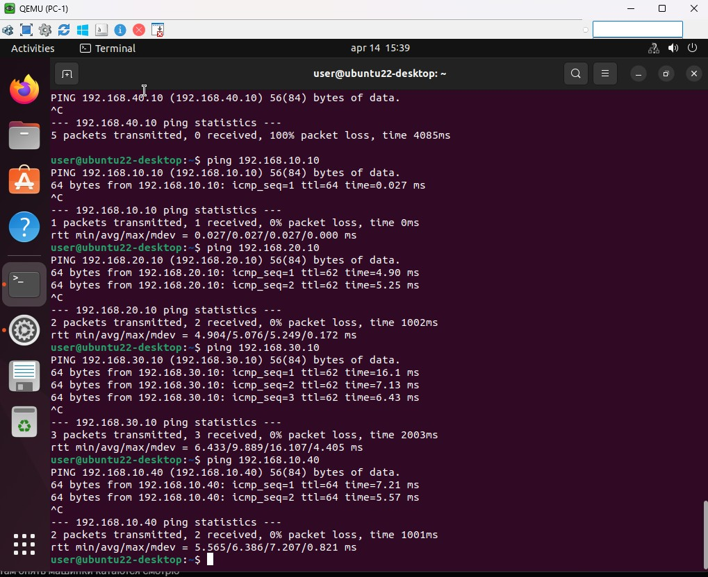
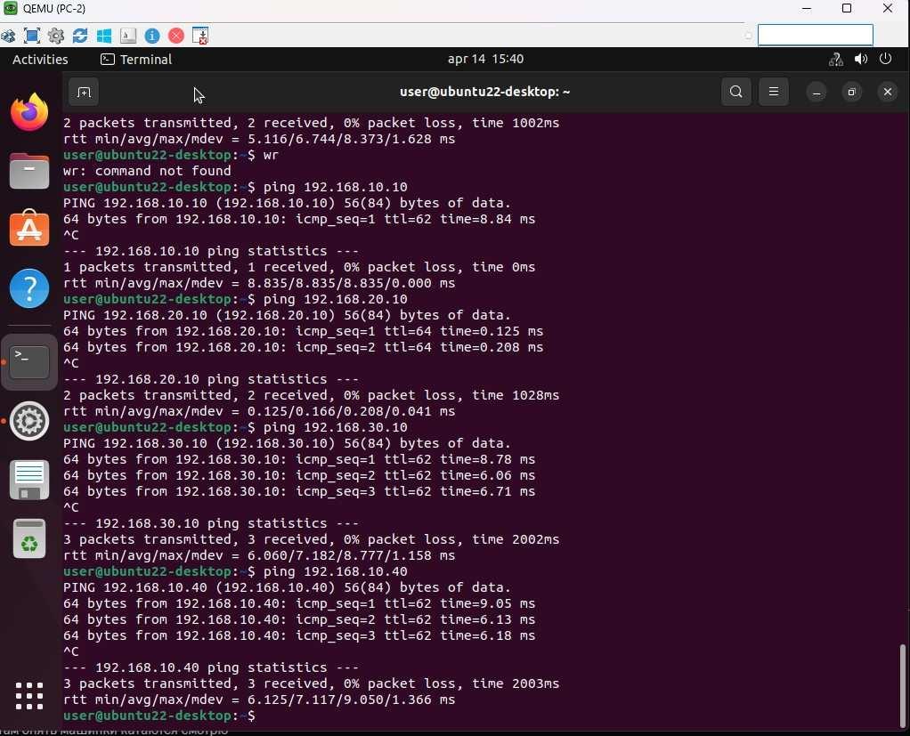
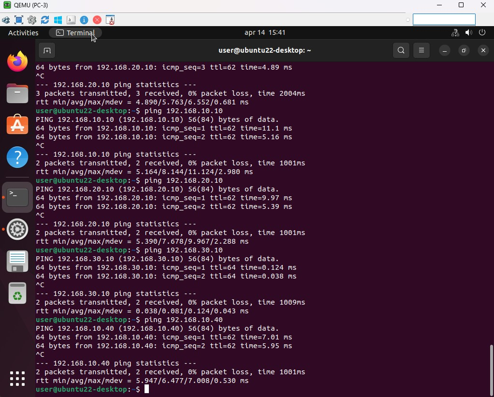
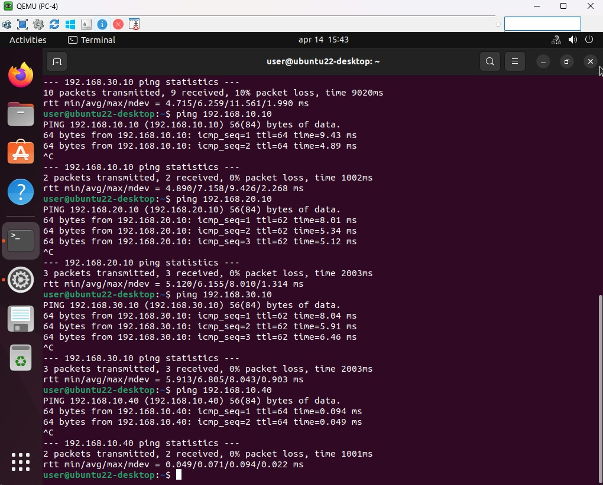

## Домашнее задание №6
### Тестовый стенд


#### Underlay и Overlay построен на iBGP AS 65000

#### Конфигурация коммутаторов
<details>
  <summary><b> Spine-1 </b></summary>
  <p> 

  ```
nv overlay evpn
feature ospf
feature bgp
feature isis
feature bfd

route-map Leaf_AS permit 10
  match as-number 65201-65299 
vrf context management


interface Ethernet1/1
  no switchport
  no ip redirects
  ip address 10.2.1.0/31
  no ipv6 redirects
  no shutdown

interface Ethernet1/2
  no switchport
  no ip redirects
  ip address 10.2.1.2/31
  no ipv6 redirects
  no shutdown

interface Ethernet1/3
  no switchport
  no ip redirects
  ip address 10.2.1.4/31
  no ipv6 redirects
  no shutdown

interface Ethernet1/4
  no switchport
  no ip redirects
  ip address 10.2.1.6/31
  no ipv6 redirects
  no shutdown

interface loopback0
  ip address 10.0.1.0/32

router bgp 65000
  router-id 10.0.1.0
  address-family ipv4 unicast
    network 10.0.1.0/32
    maximum-paths 10
  address-family l2vpn evpn
    maximum-paths 10
    maximum-paths ibgp 64
  template peer LEAF
    remote-as 65000
    update-source loopback0
    timers 3 9
    address-family l2vpn evpn
      send-community
      send-community extended
      route-reflector-client
  template peer-policy DC
    send-community
    send-community extended
    route-reflector-client
    next-hop-self all
  template peer-session DC
    remote-as 65000
    timers 3 9
  neighbor 10.1.0.1
    inherit peer LEAF
  neighbor 10.1.0.2
    inherit peer LEAF
  neighbor 10.1.0.3
    inherit peer LEAF
  neighbor 10.1.0.4
    inherit peer LEAF
  neighbor 10.2.0.0/16
    inherit peer DC
    inherit peer-session DC
    address-family ipv4 unicast
      route-reflector-client
      next-hop-self all
```
</p>
  </details>

<details>
  <summary><b> Spine-2 </b></summary>
  <p> 

```
nv overlay evpn
feature ospf
feature bgp
feature isis

interface Ethernet1/1
  no switchport
  no ip redirects
  ip address 10.2.2.0/31
  no ipv6 redirects
  no shutdown

interface Ethernet1/2
  no switchport
  no ip redirects
  ip address 10.2.2.2/31
  no ipv6 redirects
  no shutdown

interface Ethernet1/3
  no switchport
  no ip redirects
  ip address 10.2.2.4/31
  no ipv6 redirects
  no shutdown

interface Ethernet1/4
  no switchport
  no ip redirects
  ip address 10.2.2.6/31
  no ipv6 redirects
  no shutdown

interface loopback0
  ip address 10.0.2.0/32

router bgp 65000
  router-id 10.0.2.0
  address-family ipv4 unicast
    network 10.0.2.0/32
    maximum-paths 10
  address-family l2vpn evpn
    maximum-paths 10
    maximum-paths ibgp 64
  template peer LEAF
    remote-as 65000
    update-source loopback0
    timers 3 9
    address-family l2vpn evpn
      send-community
      send-community extended
      route-reflector-client
  template peer-policy DC
    send-community
    send-community extended
    route-reflector-client
    next-hop-self all
  template peer-session DC
    remote-as 65000
    timers 3 9
  neighbor 10.1.0.1
    inherit peer LEAF
  neighbor 10.1.0.2
    inherit peer LEAF
  neighbor 10.1.0.3
    inherit peer LEAF
  neighbor 10.1.0.4
    inherit peer LEAF
  neighbor 10.2.0.0/16
    inherit peer DC
    inherit peer-session DC
    address-family ipv4 unicast
      route-reflector-client
      next-hop-self all
```
</p>
  </details>

<details>
  <summary><b> Leaf-1 </b></summary>
  <p>

```
nv overlay evpn
feature ospf
feature bgp
feature isis
feature fabric forwarding
feature interface-vlan
feature vn-segment-vlan-based
feature bfd
feature nv overlay

fabric forwarding anycast-gateway-mac 0001.0002.0003
vlan 1,10,777
vlan 10
  name SERVICE_1
  vn-segment 10010
vlan 777
  name anycast_gw
  vn-segment 77777

vrf context SERVICE
  vni 77777
  rd auto
  address-family ipv4 unicast
    route-target both auto
    route-target both auto evpn
vrf context management

interface Vlan1

interface Vlan10
  no shutdown
  vrf member SERVICE
  ip address 192.168.10.1/24
  fabric forwarding mode anycast-gateway

interface Vlan777
  no shutdown
  vrf member SERVICE
  ip forward

interface nve1
  no shutdown
  host-reachability protocol bgp
  source-interface loopback1
  global ingress-replication protocol bgp
  member vni 10010
    ingress-replication protocol bgp
  member vni 77777 associate-vrf

interface Ethernet1/1
  no switchport
  no ip redirects
  ip address 10.2.1.1/31
  no ipv6 redirects
  no shutdown

interface Ethernet1/2
  no switchport
  no ip redirects
  ip address 10.2.2.1/31
  no ipv6 redirects
  no shutdown

interface Ethernet1/3
  switchport access vlan 10

interface loopback1
  ip address 10.1.0.1/32

interface loopback2
  ip address 10.1.1.1/32

router bgp 65000
  router-id 10.1.0.1
  address-family ipv4 unicast
    network 10.1.0.1/32
    network 10.1.1.1/32
    maximum-paths 10
    maximum-paths ibgp 64
  address-family l2vpn evpn
    maximum-paths 10
    maximum-paths ibgp 64
  template peer SPINE
    remote-as 65000
    update-source loopback1
    timers 3 9
    address-family l2vpn evpn
      send-community
      send-community extended
  template peer-policy DC
    send-community
    send-community extended
  template peer-session DC
    remote-as 65000
    timers 3 9
  neighbor 10.0.1.0
    inherit peer SPINE
  neighbor 10.0.2.0
    inherit peer SPINE
  neighbor 10.2.1.0
    inherit peer DC
    inherit peer-session DC
    address-family ipv4 unicast
      no next-hop-self
  neighbor 10.2.2.0
    inherit peer DC
    inherit peer-session DC
    address-family ipv4 unicast
      no next-hop-self
evpn
  vni 10010 l2
    rd auto
    route-target import auto
    route-target export auto

```
</p>
  </details>

<details>
  <summary><b> Leaf-2 </b></summary>
  <p>

```
nv overlay evpn
feature ospf
feature bgp
feature isis
feature fabric forwarding
feature interface-vlan
feature vn-segment-vlan-based
feature nv overlay

fabric forwarding anycast-gateway-mac 0001.0002.0003
vlan 1,20,777
vlan 20
  name Service_2
  vn-segment 10020
vlan 777
  name anycast_gw
  vn-segment 77777

vrf context SERVICE
  vni 77777
  rd auto
  address-family ipv4 unicast
    route-target both auto
    route-target both auto evpn

interface Vlan20
  no shutdown
  vrf member SERVICE
  ip address 192.168.20.1/24
  fabric forwarding mode anycast-gateway

interface Vlan777
  no shutdown
  vrf member SERVICE
  ip forward

interface nve1
  no shutdown
  host-reachability protocol bgp
  source-interface loopback1
  global ingress-replication protocol bgp
  member vni 10020
  member vni 77777 associate-vrf

interface Ethernet1/1
  no switchport
  no ip redirects
  ip address 10.2.1.3/31
  no ipv6 redirects
  no shutdown

interface Ethernet1/2
  no switchport
  no ip redirects
  ip address 10.2.2.3/31
  no ipv6 redirects
  no shutdown

interface Ethernet1/3
  switchport access vlan 20

interface loopback1
  ip address 10.1.0.2/32

interface loopback2
  ip address 10.1.1.2/32

router bgp 65000
  router-id 10.1.0.2
  address-family ipv4 unicast
    network 10.1.0.2/32
    network 10.1.1.2/32
    maximum-paths 10
    maximum-paths ibgp 64
  address-family l2vpn evpn
    maximum-paths 10
    maximum-paths ibgp 64
  template peer SPINE
    remote-as 65000
    update-source loopback1
    timers 3 9
    address-family l2vpn evpn
      send-community
      send-community extended
  template peer-policy DC
    send-community
    send-community extended
  template peer-session DC
    remote-as 65000
    timers 3 9
  neighbor 10.0.1.0
    inherit peer SPINE
  neighbor 10.0.2.0
    inherit peer SPINE
  neighbor 10.2.1.2
    inherit peer DC
    inherit peer-session DC
    address-family ipv4 unicast
      no next-hop-self
  neighbor 10.2.2.2
    inherit peer DC
    inherit peer-session DC
    address-family ipv4 unicast
      no next-hop-self
evpn
  vni 10010 l2
    rd auto
    route-target import auto
    route-target export auto

```
</p>
  </details>

<details>
  <summary><b> Leaf-3 </b></summary>
  <p>
    
```
nv overlay evpn
feature ospf
feature bgp
feature isis
feature fabric forwarding
feature interface-vlan
feature vn-segment-vlan-based
feature nv overlay

fabric forwarding anycast-gateway-mac 0001.0002.0003
vlan 1,10,30,777
vlan 10
  name SERVICE_1
  vn-segment 10010
vlan 30
  name Service_3
  vn-segment 10030
vlan 777
  name anycast_gw
  vn-segment 77777

vrf context SERVICE
  vni 77777
  rd auto
  address-family ipv4 unicast
    route-target both auto
    route-target both auto evpn

interface Vlan30
  no shutdown
  vrf member SERVICE
  ip address 192.168.30.1/24
  fabric forwarding mode anycast-gateway

interface Vlan777
  no shutdown
  vrf member SERVICE
  ip forward

interface nve1
  no shutdown
  host-reachability protocol bgp
  source-interface loopback1
  global suppress-arp
  global ingress-replication protocol bgp
  member vni 10010
  member vni 10030
  member vni 77777 associate-vrf

interface Ethernet1/1
  no switchport
  no ip redirects
  ip address 10.2.1.5/31
  no ipv6 redirects
  no shutdown

interface Ethernet1/2
  no switchport
  no ip redirects
  ip address 10.2.2.5/31
  no ipv6 redirects
  no shutdown

interface Ethernet1/3
  switchport access vlan 30

interface loopback1
  ip address 10.1.0.3/32

interface loopback2
  ip address 10.1.1.3/32

router bgp 65000
  router-id 10.1.0.3
  address-family ipv4 unicast
    network 10.1.0.3/32
    network 10.1.1.3/32
    maximum-paths 10
    maximum-paths ibgp 64
  address-family l2vpn evpn
    maximum-paths 10
    maximum-paths ibgp 64
  template peer SPINE
    remote-as 65000
    update-source loopback1
    timers 3 9
    address-family l2vpn evpn
      send-community
      send-community extended
  template peer-policy DC
    send-community
    send-community extended
  template peer-session DC
    remote-as 65000
    timers 3 9
  neighbor 10.0.1.0
    inherit peer SPINE
  neighbor 10.0.2.0
    inherit peer SPINE
  neighbor 10.2.1.4
    inherit peer DC
    inherit peer-session DC
    address-family ipv4 unicast
  neighbor 10.2.2.4
    inherit peer DC
    inherit peer-session DC
    address-family ipv4 unicast
evpn
  vni 10010 l2
    rd auto
    route-target import auto
    route-target export auto

```
</p>
  </details>

<details>
  <summary><b> Leaf-4 </b></summary>
  <p>

```
nv overlay evpn
feature ospf
feature bgp
feature isis
feature fabric forwarding
feature interface-vlan
feature vn-segment-vlan-based
feature nv overlay

fabric forwarding anycast-gateway-mac 0001.0002.0003
vlan 1,10,777
vlan 10
  name SERVICE_1
  vn-segment 10010
vlan 777
  name anycast_gw
  vn-segment 77777

vrf context SERVICE
  vni 77777
  rd auto
  address-family ipv4 unicast
    route-target both auto
    route-target both auto evpn
vrf context management

interface Vlan1

interface Vlan10
  no shutdown
  vrf member SERVICE
  ip address 192.168.10.1/24
  fabric forwarding mode anycast-gateway

interface Vlan777
  no shutdown
  vrf member SERVICE
  ip forward

interface nve1
  no shutdown
  host-reachability protocol bgp
  source-interface loopback1
  global ingress-replication protocol bgp
  member vni 10010
    ingress-replication protocol bgp
  member vni 77777 associate-vrf

interface Ethernet1/1
  no switchport
  no ip redirects
  ip address 10.2.1.7/31
  no ipv6 redirects
  no shutdown

interface Ethernet1/2
  no switchport
  no ip redirects
  ip address 10.2.2.7/31
  no ipv6 redirects
  no shutdown

interface Ethernet1/3
  switchport access vlan 10

interface loopback1
  ip address 10.1.0.4/32

interface loopback2
  ip address 10.1.1.4/32

router bgp 65000
  router-id 10.1.0.4
  address-family ipv4 unicast
    network 10.1.0.4/32
    network 10.1.1.4/32
    maximum-paths 10
    maximum-paths ibgp 64
  address-family l2vpn evpn
    maximum-paths 10
    maximum-paths ibgp 64
  template peer SPINE
    remote-as 65000
    update-source loopback1
    timers 3 9
    address-family l2vpn evpn
      send-community
      send-community extended
  template peer-policy DC
    send-community
    send-community extended
  template peer-session DC
    remote-as 65000
    timers 3 9
  neighbor 10.0.1.0
    inherit peer SPINE
  neighbor 10.0.2.0
    inherit peer SPINE
  neighbor 10.2.1.6
    inherit peer DC
    inherit peer-session DC
    address-family ipv4 unicast
  neighbor 10.2.2.6
    inherit peer DC
    inherit peer-session DC
    address-family ipv4 unicast
evpn
  vni 10010 l2
    rd auto
    route-target import auto
    route-target export auto
```
</p>
  </details>

#### Проверка работы L3EVPN

<details>
  <summary><b> Вывод таблицы маршрутизаци l2vpn с Leaf коммутаторов </b></summary>
  <p>

```
Leaf-1# sh bgp l2vpn evpn 
BGP routing table information for VRF default, address family L2VPN EVPN
BGP table version is 2270, Local Router ID is 10.1.0.1
Status: s-suppressed, x-deleted, S-stale, d-dampened, h-history, *-valid, >-best
Path type: i-internal, e-external, c-confed, l-local, a-aggregate, r-redist, I-i
njected
Origin codes: i - IGP, e - EGP, ? - incomplete, | - multipath, & - backup, 2 - b
est2

   Network            Next Hop            Metric     LocPrf     Weight Path
Route Distinguisher: 10.1.0.1:32777    (L2VNI 10010)
*>l[2]:[0]:[0]:[48]:[0050.0000.0700]:[0]:[0.0.0.0]/216
                      10.1.0.1                          100      32768 i
*>i[2]:[0]:[0]:[48]:[0050.0000.0b00]:[0]:[0.0.0.0]/216
                      10.1.0.4                          100          0 i
*>l[2]:[0]:[0]:[48]:[0050.0000.0700]:[32]:[192.168.10.10]/272
                      10.1.0.1                          100      32768 i
*>i[2]:[0]:[0]:[48]:[0050.0000.0b00]:[32]:[192.168.10.40]/272
                      10.1.0.4                          100          0 i
*>l[3]:[0]:[32]:[10.1.0.1]/88
                      10.1.0.1                          100      32768 i
*>i[3]:[0]:[32]:[10.1.0.3]/88
                      10.1.0.3                          100          0 i
*>i[3]:[0]:[32]:[10.1.0.4]/88
                      10.1.0.4                          100          0 i

Route Distinguisher: 10.1.0.2:32787
* i[2]:[0]:[0]:[48]:[0050.0000.0a00]:[32]:[192.168.20.10]/272
                      10.1.0.2                          100          0 i
*>i                   10.1.0.2                          100          0 i

Route Distinguisher: 10.1.0.3:32777
*>i[3]:[0]:[32]:[10.1.0.3]/88
                      10.1.0.3                          100          0 i
* i                   10.1.0.3                          100          0 i

Route Distinguisher: 10.1.0.3:32797
* i[2]:[0]:[0]:[48]:[0050.0000.0800]:[32]:[192.168.30.10]/272
                      10.1.0.3                          100          0 i
*>i                   10.1.0.3                          100          0 i

Route Distinguisher: 10.1.0.4:32777
* i[2]:[0]:[0]:[48]:[0050.0000.0b00]:[0]:[0.0.0.0]/216
                      10.1.0.4                          100          0 i
*>i                   10.1.0.4                          100          0 i
* i[2]:[0]:[0]:[48]:[0050.0000.0b00]:[32]:[192.168.10.40]/272
                      10.1.0.4                          100          0 i
*>i                   10.1.0.4                          100          0 i
* i[3]:[0]:[32]:[10.1.0.4]/88
                      10.1.0.4                          100          0 i
*>i                   10.1.0.4                          100          0 i

Route Distinguisher: 10.1.0.1:4    (L3VNI 77777)
*>i[2]:[0]:[0]:[48]:[0050.0000.0800]:[32]:[192.168.30.10]/272
                      10.1.0.3                          100          0 i
*>i[2]:[0]:[0]:[48]:[0050.0000.0a00]:[32]:[192.168.20.10]/272
                      10.1.0.2                          100          0 i
*>i[2]:[0]:[0]:[48]:[0050.0000.0b00]:[32]:[192.168.10.40]/272
                      10.1.0.4                          100          0 i

Leaf-2# sh bgp l2vpn evpn
BGP routing table information for VRF default, address family L2VPN EVPN
BGP table version is 179, Local Router ID is 10.1.0.2
Status: s-suppressed, x-deleted, S-stale, d-dampened, h-history, *-valid, >-best
Path type: i-internal, e-external, c-confed, l-local, a-aggregate, r-redist, I-i
njected
Origin codes: i - IGP, e - EGP, ? - incomplete, | - multipath, & - backup, 2 - b
est2

   Network            Next Hop            Metric     LocPrf     Weight Path
Route Distinguisher: 10.1.0.1:32777
*>i[2]:[0]:[0]:[48]:[0050.0000.0700]:[0]:[0.0.0.0]/216
                      10.1.0.1                          100          0 i
* i                   10.1.0.1                          100          0 i
*>i[2]:[0]:[0]:[48]:[0050.0000.0700]:[32]:[192.168.10.10]/272
                      10.1.0.1                          100          0 i
* i                   10.1.0.1                          100          0 i
* i[3]:[0]:[32]:[10.1.0.1]/88
                      10.1.0.1                          100          0 i
*>i                   10.1.0.1                          100          0 i

Route Distinguisher: 10.1.0.2:32787    (L2VNI 10020)
*>l[2]:[0]:[0]:[48]:[0050.0000.0a00]:[0]:[0.0.0.0]/216
                      10.1.0.2                          100      32768 i
*>l[2]:[0]:[0]:[48]:[0050.0000.0a00]:[32]:[192.168.20.10]/272
                      10.1.0.2                          100      32768 i
*>l[3]:[0]:[32]:[10.1.0.2]/88
                      10.1.0.2                          100      32768 i

Route Distinguisher: 10.1.0.3:32777
*>i[3]:[0]:[32]:[10.1.0.3]/88
                      10.1.0.3                          100          0 i
* i                   10.1.0.3                          100          0 i

Route Distinguisher: 10.1.0.3:32797
* i[2]:[0]:[0]:[48]:[0050.0000.0800]:[32]:[192.168.30.10]/272
                      10.1.0.3                          100          0 i
*>i                   10.1.0.3                          100          0 i

Route Distinguisher: 10.1.0.4:32777
* i[2]:[0]:[0]:[48]:[0050.0000.0b00]:[0]:[0.0.0.0]/216
                      10.1.0.4                          100          0 i
*>i                   10.1.0.4                          100          0 i
* i[2]:[0]:[0]:[48]:[0050.0000.0b00]:[32]:[192.168.10.40]/272
                      10.1.0.4                          100          0 i
*>i                   10.1.0.4                          100          0 i
* i[3]:[0]:[32]:[10.1.0.4]/88
                      10.1.0.4                          100          0 i
*>i                   10.1.0.4                          100          0 i

Route Distinguisher: 10.1.0.2:4    (L3VNI 77777)
*>i[2]:[0]:[0]:[48]:[0050.0000.0700]:[32]:[192.168.10.10]/272
                      10.1.0.1                          100          0 i
*>i[2]:[0]:[0]:[48]:[0050.0000.0800]:[32]:[192.168.30.10]/272
                      10.1.0.3                          100          0 i
*>i[2]:[0]:[0]:[48]:[0050.0000.0b00]:[32]:[192.168.10.40]/272
                      10.1.0.4                          100          0 i

Leaf-3# sh bgp l2vpn evpn
BGP routing table information for VRF default, address family L2VPN EVPN
BGP table version is 177, Local Router ID is 10.1.0.3
Status: s-suppressed, x-deleted, S-stale, d-dampened, h-history, *-valid, >-best
Path type: i-internal, e-external, c-confed, l-local, a-aggregate, r-redist, I-i
njected
Origin codes: i - IGP, e - EGP, ? - incomplete, | - multipath, & - backup, 2 - b
est2

   Network            Next Hop            Metric     LocPrf     Weight Path
Route Distinguisher: 10.1.0.1:32777
* i[2]:[0]:[0]:[48]:[0050.0000.0700]:[0]:[0.0.0.0]/216
                      10.1.0.1                          100          0 i
*>i                   10.1.0.1                          100          0 i
*>i[2]:[0]:[0]:[48]:[0050.0000.0700]:[32]:[192.168.10.10]/272
                      10.1.0.1                          100          0 i
* i                   10.1.0.1                          100          0 i
* i[3]:[0]:[32]:[10.1.0.1]/88
                      10.1.0.1                          100          0 i
*>i                   10.1.0.1                          100          0 i

Route Distinguisher: 10.1.0.2:32787
* i[2]:[0]:[0]:[48]:[0050.0000.0a00]:[32]:[192.168.20.10]/272
                      10.1.0.2                          100          0 i
*>i                   10.1.0.2                          100          0 i

Route Distinguisher: 10.1.0.3:32777    (L2VNI 10010)
*>i[2]:[0]:[0]:[48]:[0050.0000.0700]:[0]:[0.0.0.0]/216
                      10.1.0.1                          100          0 i
*>i[2]:[0]:[0]:[48]:[0050.0000.0b00]:[0]:[0.0.0.0]/216
                      10.1.0.4                          100          0 i
*>i[2]:[0]:[0]:[48]:[0050.0000.0700]:[32]:[192.168.10.10]/272
                      10.1.0.1                          100          0 i
*>i[2]:[0]:[0]:[48]:[0050.0000.0b00]:[32]:[192.168.10.40]/272
                      10.1.0.4                          100          0 i
*>i[3]:[0]:[32]:[10.1.0.1]/88
                      10.1.0.1                          100          0 i
*>l[3]:[0]:[32]:[10.1.0.3]/88
                      10.1.0.3                          100      32768 i
*>i[3]:[0]:[32]:[10.1.0.4]/88
                      10.1.0.4                          100          0 i

Route Distinguisher: 10.1.0.3:32797    (L2VNI 10030)
*>l[2]:[0]:[0]:[48]:[0050.0000.0800]:[0]:[0.0.0.0]/216
                      10.1.0.3                          100      32768 i
*>l[2]:[0]:[0]:[48]:[0050.0000.0800]:[32]:[192.168.30.10]/272
                      10.1.0.3                          100      32768 i
*>l[3]:[0]:[32]:[10.1.0.3]/88
                      10.1.0.3                          100      32768 i

Route Distinguisher: 10.1.0.4:32777
* i[2]:[0]:[0]:[48]:[0050.0000.0b00]:[0]:[0.0.0.0]/216
                      10.1.0.4                          100          0 i
*>i                   10.1.0.4                          100          0 i
*>i[2]:[0]:[0]:[48]:[0050.0000.0b00]:[32]:[192.168.10.40]/272
                      10.1.0.4                          100          0 i
* i                   10.1.0.4                          100          0 i
* i[3]:[0]:[32]:[10.1.0.4]/88
                      10.1.0.4                          100          0 i
*>i                   10.1.0.4                          100          0 i

Route Distinguisher: 10.1.0.3:4    (L3VNI 77777)
*>i[2]:[0]:[0]:[48]:[0050.0000.0700]:[32]:[192.168.10.10]/272
                      10.1.0.1                          100          0 i
*>i[2]:[0]:[0]:[48]:[0050.0000.0a00]:[32]:[192.168.20.10]/272
                      10.1.0.2                          100          0 i
*>i[2]:[0]:[0]:[48]:[0050.0000.0b00]:[32]:[192.168.10.40]/272
                      10.1.0.4                          100          0 i

Leaf-4# sh bgp l2vpn evpn
BGP routing table information for VRF default, address family L2VPN EVPN
BGP table version is 2301, Local Router ID is 10.1.0.4
Status: s-suppressed, x-deleted, S-stale, d-dampened, h-history, *-valid, >-best
Path type: i-internal, e-external, c-confed, l-local, a-aggregate, r-redist, I-i
njected
Origin codes: i - IGP, e - EGP, ? - incomplete, | - multipath, & - backup, 2 - b
est2

   Network            Next Hop            Metric     LocPrf     Weight Path
Route Distinguisher: 10.1.0.1:32777
* i[2]:[0]:[0]:[48]:[0050.0000.0700]:[0]:[0.0.0.0]/216
                      10.1.0.1                          100          0 i
*>i                   10.1.0.1                          100          0 i
*>i[2]:[0]:[0]:[48]:[0050.0000.0700]:[32]:[192.168.10.10]/272
                      10.1.0.1                          100          0 i
* i                   10.1.0.1                          100          0 i
*>i[3]:[0]:[32]:[10.1.0.1]/88
                      10.1.0.1                          100          0 i
* i                   10.1.0.1                          100          0 i

Route Distinguisher: 10.1.0.2:32787
* i[2]:[0]:[0]:[48]:[0050.0000.0a00]:[32]:[192.168.20.10]/272
                      10.1.0.2                          100          0 i
*>i                   10.1.0.2                          100          0 i

Route Distinguisher: 10.1.0.3:32777
*>i[3]:[0]:[32]:[10.1.0.3]/88
                      10.1.0.3                          100          0 i
* i                   10.1.0.3                          100          0 i

Route Distinguisher: 10.1.0.3:32797
* i[2]:[0]:[0]:[48]:[0050.0000.0800]:[32]:[192.168.30.10]/272
                      10.1.0.3                          100          0 i
*>i                   10.1.0.3                          100          0 i

Route Distinguisher: 10.1.0.4:32777    (L2VNI 10010)
*>i[2]:[0]:[0]:[48]:[0050.0000.0700]:[0]:[0.0.0.0]/216
                      10.1.0.1                          100          0 i
*>l[2]:[0]:[0]:[48]:[0050.0000.0b00]:[0]:[0.0.0.0]/216
                      10.1.0.4                          100      32768 i
*>i[2]:[0]:[0]:[48]:[0050.0000.0700]:[32]:[192.168.10.10]/272
                      10.1.0.1                          100          0 i
*>l[2]:[0]:[0]:[48]:[0050.0000.0b00]:[32]:[192.168.10.40]/272
                      10.1.0.4                          100      32768 i
*>i[3]:[0]:[32]:[10.1.0.1]/88
                      10.1.0.1                          100          0 i
*>i[3]:[0]:[32]:[10.1.0.3]/88
                      10.1.0.3                          100          0 i
*>l[3]:[0]:[32]:[10.1.0.4]/88
                      10.1.0.4                          100      32768 i

Route Distinguisher: 10.1.0.4:4    (L3VNI 77777)
*>i[2]:[0]:[0]:[48]:[0050.0000.0700]:[32]:[192.168.10.10]/272
                      10.1.0.1                          100          0 i
*>i[2]:[0]:[0]:[48]:[0050.0000.0800]:[32]:[192.168.30.10]/272
                      10.1.0.3                          100          0 i
*>i[2]:[0]:[0]:[48]:[0050.0000.0a00]:[32]:[192.168.20.10]/272
                      10.1.0.2                          100          0 i
```
</p>
  </details>

<details>
  <summary><b> Вывод таблицы таблицы MAC адресов с Leaf коммутаторов </b></summary>
  <p>

  ```
Leaf-1# show mac address-table 
Legend: 
        * - primary entry, G - Gateway MAC, (R) - Routed MAC, O - Overlay MAC
        age - seconds since last seen,+ - primary entry using vPC Peer-Link,
        (T) - True, (F) - False, C - ControlPlane MAC, ~ - vsan,
        (NA)- Not Applicable
   VLAN     MAC Address      Type      age     Secure NTFY Ports
---------+-----------------+--------+---------+------+----+------------------
*   10     0050.0000.0700   dynamic  NA         F      F    Eth1/3
C   10     0050.0000.0b00   dynamic  NA         F      F    nve1(10.1.0.4)
*  777     5004.0000.1b08   static   -         F      F    Vlan777
*  777     5005.0000.1b08   static   -         F      F    nve1(10.1.0.2)
*  777     5006.0000.1b08   static   -         F      F    nve1(10.1.0.3)
*  777     5009.0000.1b08   static   -         F      F    nve1(10.1.0.4)
G    -     0001.0002.0003   static   -         F      F    sup-eth1(R)
G    -     5004.0000.1b08   static   -         F      F    sup-eth1(R)
G  777     5004.0000.1b08   static   -         F      F    sup-eth1(R)
G   10     5004.0000.1b08   static   -         F      F    sup-eth1(R)

Leaf-2# show mac address-table 
Legend: 
        * - primary entry, G - Gateway MAC, (R) - Routed MAC, O - Overlay MAC
        age - seconds since last seen,+ - primary entry using vPC Peer-Link,
        (T) - True, (F) - False, C - ControlPlane MAC, ~ - vsan,
        (NA)- Not Applicable
   VLAN     MAC Address      Type      age     Secure NTFY Ports
---------+-----------------+--------+---------+------+----+------------------
*   20     0050.0000.0a00   dynamic  NA         F      F    Eth1/3
*  777     5004.0000.1b08   static   -         F      F    nve1(10.1.0.1)
*  777     5005.0000.1b08   static   -         F      F    Vlan777
*  777     5006.0000.1b08   static   -         F      F    nve1(10.1.0.3)
*  777     5009.0000.1b08   static   -         F      F    nve1(10.1.0.4)
G    -     0001.0002.0003   static   -         F      F    sup-eth1(R)
G    -     5005.0000.1b08   static   -         F      F    sup-eth1(R)
G  777     5005.0000.1b08   static   -         F      F    sup-eth1(R)
G   20     5005.0000.1b08   static   -         F      F    sup-eth1(R)

Leaf-3# show mac address-table 
Legend: 
        * - primary entry, G - Gateway MAC, (R) - Routed MAC, O - Overlay MAC
        age - seconds since last seen,+ - primary entry using vPC Peer-Link,
        (T) - True, (F) - False, C - ControlPlane MAC, ~ - vsan,
        (NA)- Not Applicable
   VLAN     MAC Address      Type      age     Secure NTFY Ports
---------+-----------------+--------+---------+------+----+------------------
C   10     0050.0000.0700   dynamic  NA         F      F    nve1(10.1.0.1)
C   10     0050.0000.0b00   dynamic  NA         F      F    nve1(10.1.0.4)
*   30     0050.0000.0800   dynamic  NA         F      F    Eth1/3
*  777     5004.0000.1b08   static   -         F      F    nve1(10.1.0.1)
*  777     5005.0000.1b08   static   -         F      F    nve1(10.1.0.2)
*  777     5006.0000.1b08   static   -         F      F    Vlan777
*  777     5009.0000.1b08   static   -         F      F    nve1(10.1.0.4)
G    -     0001.0002.0003   static   -         F      F    sup-eth1(R)
G    -     5006.0000.1b08   static   -         F      F    sup-eth1(R)
G  777     5006.0000.1b08   static   -         F      F    sup-eth1(R)
G   30     5006.0000.1b08   static   -         F      F    sup-eth1(R)

Leaf-4# show mac address-table 
Legend: 
        * - primary entry, G - Gateway MAC, (R) - Routed MAC, O - Overlay MAC
        age - seconds since last seen,+ - primary entry using vPC Peer-Link,
        (T) - True, (F) - False, C - ControlPlane MAC, ~ - vsan,
        (NA)- Not Applicable
   VLAN     MAC Address      Type      age     Secure NTFY Ports
---------+-----------------+--------+---------+------+----+------------------
C   10     0050.0000.0700   dynamic  NA         F      F    nve1(10.1.0.1)
*   10     0050.0000.0b00   dynamic  NA         F      F    Eth1/3
*  777     5004.0000.1b08   static   -         F      F    nve1(10.1.0.1)
*  777     5005.0000.1b08   static   -         F      F    nve1(10.1.0.2)
*  777     5006.0000.1b08   static   -         F      F    nve1(10.1.0.3)
*  777     5009.0000.1b08   static   -         F      F    Vlan777
G    -     0001.0002.0003   static   -         F      F    sup-eth1(R)
G    -     5009.0000.1b08   static   -         F      F    sup-eth1(R)
G  777     5009.0000.1b08   static   -         F      F    sup-eth1(R)
G   10     5009.0000.1b08   static   -         F      F    sup-eth1(R)

```
</p>
  </details>

##### Проверка доступности хостов с PC-1


##### Проверка доступности хостов с PC-2


##### Проверка доступности хостов с PC-3


##### Проверка доступности хостов с PC-4

