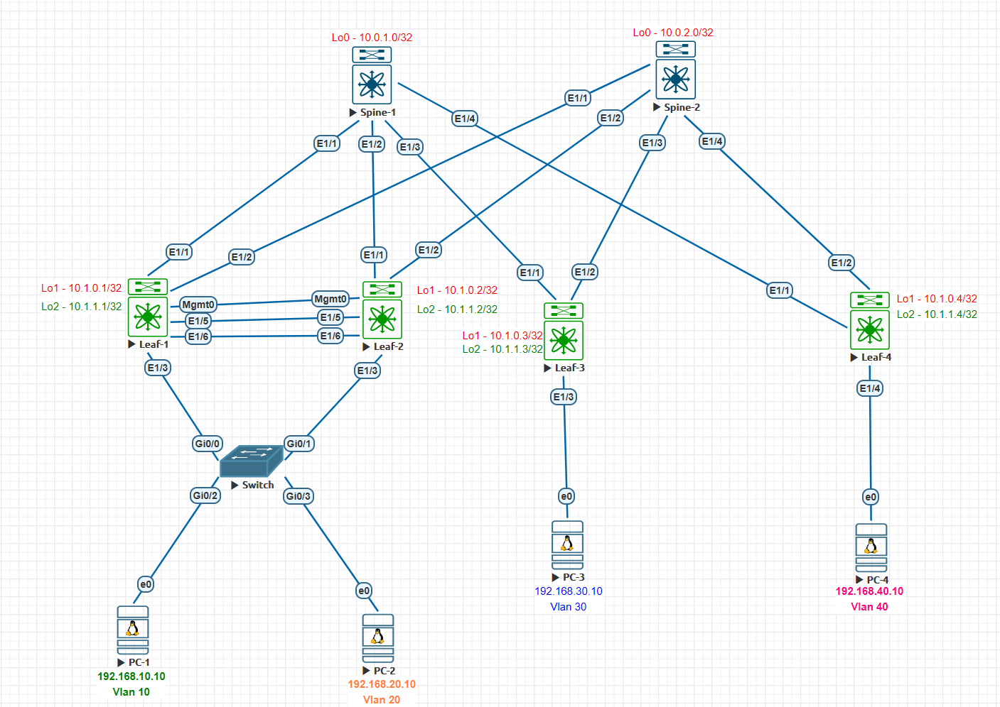
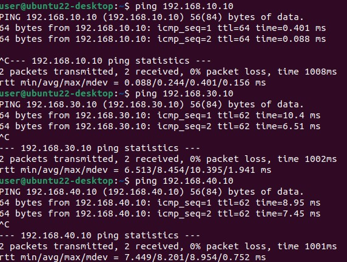
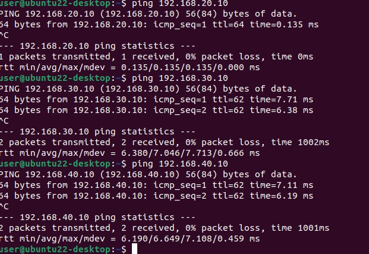

## Домашнее задание №7
### Тестовый стенд


#### Underlay и Overlay построен на iBGP AS 65000

#### Конфигурация коммутаторов
<details>
  <summary><b> Spine-1 </b></summary>
  <p> 

  ```    
    nv overlay evpn
    feature ospf
    feature bgp
    feature isis
    feature bfd
    
    route-map Leaf_AS permit 10
      match as-number 65201-65299 
    vrf context management
    
    
    interface Ethernet1/1
      no switchport
      no ip redirects
      ip address 10.2.1.0/31
      no ipv6 redirects
      no shutdown
    
    interface Ethernet1/2
      no switchport
      no ip redirects
      ip address 10.2.1.2/31
      no ipv6 redirects
      no shutdown
    
    interface Ethernet1/3
      no switchport
      no ip redirects
      ip address 10.2.1.4/31
      no ipv6 redirects
      no shutdown
    
    interface Ethernet1/4
      no switchport
      no ip redirects
      ip address 10.2.1.6/31
      no ipv6 redirects
      no shutdown
  
    interface loopback0
    ip address 10.0.1.0/32
    icam monitor scale
  
    cli alias name wr copy running-config startup-config
    line console
    line vty
    boot nxos bootflash:/nxos64-cs.10.3.5.M.bin 
    router bgp 65000
      router-id 10.0.1.0
      address-family ipv4 unicast
        network 10.0.1.0/32
        maximum-paths 10
      address-family l2vpn evpn
        maximum-paths 10
        maximum-paths ibgp 64
      template peer LEAF
        remote-as 65000
        update-source loopback0
        timers 3 9
        address-family l2vpn evpn
          send-community
          send-community extended
          route-reflector-client
      template peer-policy DC
        send-community
        send-community extended
        route-reflector-client
        next-hop-self all
      template peer-session DC
        remote-as 65000
        timers 3 9
      neighbor 10.1.0.1
        inherit peer LEAF
      neighbor 10.1.0.2
        inherit peer LEAF
      neighbor 10.1.0.3
        inherit peer LEAF
      neighbor 10.1.0.4
        inherit peer LEAF
      neighbor 10.2.0.0/16
        inherit peer DC
        inherit peer-session DC
        address-family ipv4 unicast
          route-reflector-client
          next-hop-self all
```
</p>
  </details>

<details>
  <summary><b> Spine-2 </b></summary>
  <p> 

```

nv overlay evpn
feature ospf
feature bgp
feature isis

interface Ethernet1/1
  no switchport
  no ip redirects
  ip address 10.2.2.0/31
  no ipv6 redirects
  no shutdown

interface Ethernet1/2
  no switchport
  no ip redirects
  ip address 10.2.2.2/31
  no ipv6 redirects
  no shutdown

interface Ethernet1/3
  no switchport
  no ip redirects
  ip address 10.2.2.4/31
  no ipv6 redirects
  no shutdown

interface Ethernet1/4
  no switchport
  no ip redirects
  ip address 10.2.2.6/31
  no ipv6 redirects
  no shutdown

interface loopback0
  ip address 10.0.2.0/32

router bgp 65000
  router-id 10.0.2.0
  address-family ipv4 unicast
    network 10.0.2.0/32
    maximum-paths 10
  address-family l2vpn evpn
    maximum-paths 10
    maximum-paths ibgp 64
  template peer LEAF
    remote-as 65000
    update-source loopback0
    timers 3 9
    address-family l2vpn evpn
      send-community
      send-community extended
      route-reflector-client
  template peer-policy DC
    send-community
    send-community extended
    route-reflector-client
    next-hop-self all
  template peer-session DC
    remote-as 65000
    timers 3 9
  neighbor 10.1.0.1
    inherit peer LEAF
  neighbor 10.1.0.2
    inherit peer LEAF
  neighbor 10.1.0.3
    inherit peer LEAF
  neighbor 10.1.0.4
    inherit peer LEAF
  neighbor 10.2.0.0/16
    inherit peer DC
    inherit peer-session DC
    address-family ipv4 unicast
      route-reflector-client
      next-hop-self all
```
</p>
  </details>

<details>
  <summary><b> Leaf-1 </b></summary>
  <p>

```
nv overlay evpn
feature ospf
feature bgp
feature pim
feature isis
feature fabric forwarding
feature interface-vlan
feature vn-segment-vlan-based
feature lacp
feature vpc
feature bfd
feature nv overlay

fabric forwarding anycast-gateway-mac 0001.0002.0003
vlan 1,10,20,777,999
vlan 10
  name SERVICE10
  vn-segment 101010
vlan 20
  name SERVICE2
  vn-segment 10020
vlan 777
  name anycast_gw
  vn-segment 77777
vlan 999
  name native

route-map RD permit 10
  match interface loopback1 loopback2 
vrf context SERVICE
  vni 77777
  rd auto
  address-family ipv4 unicast
    route-target both auto
    route-target both auto evpn
vrf context management
vpc domain 1
  peer-switch
  role priority 1
  system-mac 00:11:00:22:00:33
  system-priority 100
  peer-keepalive destination 192.168.254.2 source 192.168.254.1
  delay restore 60
  peer-gateway
  layer3 peer-router
  auto-recovery
  fast-convergence
  ip arp synchronize


interface Vlan1
  no ip redirects
  no ipv6 redirects

interface Vlan10
  no shutdown
  vrf member SERVICE
  ip address 192.168.10.1/24
  no ipv6 redirects
  fabric forwarding mode anycast-gateway

interface Vlan20
  no shutdown
  vrf member SERVICE
  no ip redirects
  ip address 192.168.20.1/24
  no ipv6 redirects
  fabric forwarding mode anycast-gateway

interface Vlan777
  no shutdown
  vrf member SERVICE
  no ip redirects
  ip forward
  no ipv6 redirects

interface port-channel1
  description PC1
  switchport mode trunk
  switchport access vlan 10
  spanning-tree port type edge
  vpc 1

interface port-channel2
  description PC2
  switchport mode trunk
  switchport access vlan 20
  spanning-tree port type edge

interface port-channel100
  description vPC_PeerLink
  switchport mode trunk
  switchport trunk native vlan 999
  spanning-tree port type network
  vpc peer-link

interface nve1
  no shutdown
  host-reachability protocol bgp
  advertise virtual-rmac
  source-interface loopback1
  global ingress-replication protocol bgp
  member vni 10010
    ingress-replication protocol bgp
  member vni 10020
  member vni 77777 associate-vrf
  member vni 101010

interface Ethernet1/1
  no switchport
  no ip redirects
  ip address 10.2.1.1/31
  no ipv6 redirects
  no shutdown

interface Ethernet1/2
  no switchport
  no ip redirects
  ip address 10.2.2.1/31
  no ipv6 redirects
  no shutdown

interface Ethernet1/3
  description PC1
  switchport mode trunk
  switchport access vlan 10
  spanning-tree port type edge
  channel-group 1 mode active

interface Ethernet1/4
  description PC2
  switchport mode trunk
  switchport access vlan 20
  spanning-tree port type edge
  channel-group 2 mode active

interface Ethernet1/5
  description vPC_PeerLink
  switchport mode trunk
  switchport trunk native vlan 999
  channel-group 100 mode active

interface Ethernet1/6
  description vPC_PeerLink
  switchport mode trunk
  switchport trunk native vlan 999
  channel-group 100 mode active

interface mgmt0
  vrf member management
  ip address 192.168.254.1/24

interface loopback1
  ip address 10.1.0.1/32
  ip address 10.1.0.111/32 secondary

interface loopback2
  ip address 10.1.1.1/32

router bgp 65000
  router-id 10.1.0.1
  address-family ipv4 unicast
    redistribute direct route-map RD
    maximum-paths 10
    maximum-paths ibgp 64
  address-family l2vpn evpn
    maximum-paths 10
    maximum-paths ibgp 64
  template peer SPINE
    remote-as 65000
    update-source loopback1
    timers 3 9
    address-family l2vpn evpn
      send-community
      send-community extended
  template peer-policy DC
    send-community
    send-community extended
  template peer-session DC
    remote-as 65000
    timers 3 9
  neighbor 10.0.1.0
    inherit peer SPINE
  neighbor 10.0.2.0
    inherit peer SPINE
  neighbor 10.2.1.0
    inherit peer DC
    inherit peer-session DC
    address-family ipv4 unicast
      no next-hop-self
  neighbor 10.2.2.0
    inherit peer DC
    inherit peer-session DC
    address-family ipv4 unicast
      no next-hop-self
evpn
  vni 10010 l2
    rd auto
    route-target import auto
    route-target export auto

```
</p>
  </details>

<details>
  <summary><b> Leaf-2 </b></summary>
  <p>

```
nv overlay evpn
feature ospf
feature bgp
feature pim
feature isis
feature fabric forwarding
feature interface-vlan
feature vn-segment-vlan-based
feature lacp
feature vpc
feature nv overlay

fabric forwarding anycast-gateway-mac 0001.0002.0003
vlan 1,10,20,777,999
vlan 10
  name SERVICE10
  vn-segment 101010
vlan 20
  name SERVICE2
  vn-segment 10020
vlan 777
  name anycast_gw
  vn-segment 77777
vlan 999
  name native

spanning-tree vlan 1-3967 priority 28672
route-map RD permit 10
  match interface loopback1 loopback2 
vrf context SERVICE
  vni 77777
  rd auto
  address-family ipv4 unicast
    route-target both auto
    route-target both auto evpn
vrf context management
vpc domain 1
  peer-switch
  role priority 2
  system-mac 00:11:00:22:00:33
  system-priority 100
  peer-keepalive destination 192.168.254.1 source 192.168.254.2
  delay restore 60
  peer-gateway
  layer3 peer-router
  auto-recovery
  fast-convergence
  ip arp synchronize


interface Vlan1
  no ip redirects
  no ipv6 redirects

interface Vlan10
  no shutdown
  vrf member SERVICE
  no ip redirects
  ip address 192.168.10.1/24
  no ipv6 redirects
  fabric forwarding mode anycast-gateway

interface Vlan20
  no shutdown
  vrf member SERVICE
  no ip redirects
  ip address 192.168.20.1/24
  no ipv6 redirects
  fabric forwarding mode anycast-gateway

interface Vlan777
  no shutdown
  vrf member SERVICE
  no ip redirects
  ip forward
  no ipv6 redirects

interface port-channel1
  description PC1
  switchport mode trunk
  switchport access vlan 10
  spanning-tree port type edge
  vpc 1

interface port-channel2
  description PC2
  switchport mode trunk
  switchport access vlan 20
  spanning-tree port type edge

interface port-channel100
  description vPC_PeerLink
  switchport mode trunk
  switchport trunk native vlan 999
  spanning-tree port type network
  vpc peer-link

interface nve1
  no shutdown
  host-reachability protocol bgp
  advertise virtual-rmac
  source-interface loopback1
  global ingress-replication protocol bgp
  member vni 10010
  member vni 10020
  member vni 77777 associate-vrf
  member vni 101010

interface Ethernet1/1
  no switchport
  no ip redirects
  ip address 10.2.1.3/31
  no ipv6 redirects
  no shutdown

interface Ethernet1/2
  no switchport
  no ip redirects
  ip address 10.2.2.3/31
  no ipv6 redirects
  no shutdown

interface Ethernet1/3
  description PC1
  switchport mode trunk
  switchport access vlan 10
  spanning-tree port type edge
  channel-group 1 mode active

interface Ethernet1/4
  description PC2
  switchport mode trunk
  switchport access vlan 20
  spanning-tree port type edge
  channel-group 2 mode active

interface Ethernet1/5
  description vPC_PeerLink
  switchport mode trunk
  switchport trunk native vlan 999
  channel-group 100 mode active

interface Ethernet1/6
  description vPC_PeerLink
  switchport mode trunk
  switchport trunk native vlan 999
  channel-group 100 mode active

interface mgmt0
  vrf member management
  ip address 192.168.254.2/24

interface loopback1
  ip address 10.1.0.2/32
  ip address 10.1.0.111/32 secondary

interface loopback2
  ip address 10.1.1.2/32

router bgp 65000
  router-id 10.1.0.2
  address-family ipv4 unicast
    redistribute direct route-map RD
    maximum-paths 10
    maximum-paths ibgp 64
  address-family l2vpn evpn
    maximum-paths 10
    maximum-paths ibgp 64
  template peer SPINE
    remote-as 65000
    update-source loopback1
    timers 3 9
    address-family l2vpn evpn
      send-community
      send-community extended
  template peer-policy DC
    send-community
    send-community extended
  template peer-session DC
    remote-as 65000
    timers 3 9
  neighbor 10.0.1.0
    inherit peer SPINE
  neighbor 10.0.2.0
    inherit peer SPINE
  neighbor 10.2.1.2
    inherit peer DC
    inherit peer-session DC
    address-family ipv4 unicast
      no next-hop-self
  neighbor 10.2.2.2
    inherit peer DC
    inherit peer-session DC
    address-family ipv4 unicast
      no next-hop-self
evpn
  vni 10010 l2
    rd auto
    route-target import auto
    route-target export auto

```
</p>
  </details>

<details>
  <summary><b> Leaf-3 </b></summary>
  <p>
    
```
nv overlay evpn
feature ospf
feature bgp
feature isis
feature fabric forwarding
feature interface-vlan
feature vn-segment-vlan-based
feature nv overlay

fabric forwarding anycast-gateway-mac 0001.0002.0003
vlan 1,30,777
vlan 30
  name Service_3
  vn-segment 10030
vlan 777
  name anycast_gw
  vn-segment 77777

vrf context SERVICE
  vni 77777
  rd auto
  address-family ipv4 unicast
    route-target both auto
    route-target both auto evpn
vrf context management

interface Vlan1

interface Vlan30
  no shutdown
  vrf member SERVICE
  ip address 192.168.30.1/24
  fabric forwarding mode anycast-gateway

interface Vlan777
  no shutdown
  vrf member SERVICE
  ip forward

interface nve1
  no shutdown
  host-reachability protocol bgp
  source-interface loopback1
  global suppress-arp
  global ingress-replication protocol bgp
  member vni 10010
  member vni 10030
  member vni 77777 associate-vrf

interface Ethernet1/1
  no switchport
  no ip redirects
  ip address 10.2.1.5/31
  no ipv6 redirects
  no shutdown

interface Ethernet1/2
  no switchport
  no ip redirects
  ip address 10.2.2.5/31
  no ipv6 redirects
  no shutdown

interface Ethernet1/3
  switchport access vlan 30

interface loopback1
  ip address 10.1.0.3/32

interface loopback2
  ip address 10.1.1.3/32

router bgp 65000
  router-id 10.1.0.3
  address-family ipv4 unicast
    network 10.1.0.3/32
    network 10.1.1.3/32
    maximum-paths 10
    maximum-paths ibgp 64
  address-family l2vpn evpn
    maximum-paths 10
    maximum-paths ibgp 64
  template peer SPINE
    remote-as 65000
    update-source loopback1
    timers 3 9
    address-family l2vpn evpn
      send-community
      send-community extended
  template peer-policy DC
    send-community
    send-community extended
  template peer-session DC
    remote-as 65000
    timers 3 9
  neighbor 10.0.1.0
    inherit peer SPINE
  neighbor 10.0.2.0
    inherit peer SPINE
  neighbor 10.2.1.4
    inherit peer DC
    inherit peer-session DC
    address-family ipv4 unicast
  neighbor 10.2.2.4
    inherit peer DC
    inherit peer-session DC
    address-family ipv4 unicast
evpn
  vni 10010 l2
    rd auto
    route-target import auto
    route-target export auto

```
</p>
  </details>

<details>
  <summary><b> Leaf-4 </b></summary>
  <p>

```
nv overlay evpn
feature ospf
feature bgp
feature isis
feature fabric forwarding
feature interface-vlan
feature vn-segment-vlan-based
feature nv overlay

fabric forwarding anycast-gateway-mac 0001.0002.0003
vlan 1,40,777
vlan 40
  name SERVICE40
  vn-segment 10040
vlan 777
  name anycast_gw
  vn-segment 77777

vrf context SERVICE
  vni 77777
  rd auto
  address-family ipv4 unicast
    route-target both auto
    route-target both auto evpn
vrf context management

interface Vlan1

interface Vlan40
  no shutdown
  vrf member SERVICE
  ip address 192.168.40.1/24
  fabric forwarding mode anycast-gateway

interface Vlan777
  no shutdown
  vrf member SERVICE
  ip forward

interface nve1
  no shutdown
  host-reachability protocol bgp
  source-interface loopback1
  global ingress-replication protocol bgp
  member vni 10010
    ingress-replication protocol bgp
  member vni 10040
  member vni 77777 associate-vrf

interface Ethernet1/1
  no switchport
  no ip redirects
  ip address 10.2.1.7/31
  no ipv6 redirects
  no shutdown

interface Ethernet1/2
  no switchport
  no ip redirects
  ip address 10.2.2.7/31
  no ipv6 redirects
  no shutdown

interface Ethernet1/3
  switchport access vlan 10

interface Ethernet1/4
  switchport access vlan 40

interface loopback1
  ip address 10.1.0.4/32

interface loopback2
  ip address 10.1.1.4/32

router bgp 65000
  router-id 10.1.0.4
  address-family ipv4 unicast
    network 10.1.0.4/32
    network 10.1.1.4/32
    maximum-paths 10
    maximum-paths ibgp 64
  address-family l2vpn evpn
    maximum-paths 10
    maximum-paths ibgp 64
  template peer SPINE
    remote-as 65000
    update-source loopback1
    timers 3 9
    address-family l2vpn evpn
      send-community
      send-community extended
  template peer-policy DC
    send-community
    send-community extended
  template peer-session DC
    remote-as 65000
    timers 3 9
  neighbor 10.0.1.0
    inherit peer SPINE
  neighbor 10.0.2.0
    inherit peer SPINE
  neighbor 10.2.1.6
    inherit peer DC
    inherit peer-session DC
    address-family ipv4 unicast
  neighbor 10.2.2.6
    inherit peer DC
    inherit peer-session DC
    address-family ipv4 unicast
evpn
  vni 10010 l2
    rd auto
    route-target import auto
    route-target export auto
```
</p>
  </details>

#### vPC настроен на Leaf-1 и Leaf-2
##### Peer Link собран напрямую, интерфейс Po100
##### Keepalive ходит через mgmt0 в vrf management
##### Проверка корректности настроек vPC
<details>
  <summary><b> Leaf-1 </b></summary>
  <p>
    
```
Leaf-1#  sh vpc
Legend:
                (*) - local vPC is down, forwarding via vPC peer-link

vPC domain id                     : 1   
Peer status                       : peer adjacency formed ok      
vPC keep-alive status             : peer is alive                 
Configuration consistency status  : success 
Per-vlan consistency status       : success                       
Type-2 consistency status         : success 
vPC role                          : primary                       
Number of vPCs configured         : 1   
Peer Gateway                      : Enabled
Dual-active excluded VLANs        : -
Graceful Consistency Check        : Enabled
Auto-recovery status              : Enabled, timer is off.(timeout = 240s)
Delay-restore status              : Timer is off.(timeout = 60s)
Delay-restore SVI status          : Timer is off.(timeout = 10s)
Delay-restore Orphan-port status  : Timer is off.(timeout = 0s)
Operational Layer3 Peer-router    : Enabled
Virtual-peerlink mode             : Disabled

vPC Peer-link status
---------------------------------------------------------------------
id    Port   Status Active vlans    
--    ----   ------ -------------------------------------------------
1     Po100  up     1,10,20,777,999                                             
         

vPC status
----------------------------------------------------------------------------
Id    Port          Status Consistency Reason                Active vlans
--    ------------  ------ ----------- ------                ---------------
1     Po1           up     success     success               1,10,20,777,999

```
</p>
  </details>

<details>
  <summary><b> Leaf-2 </b></summary>
  <p>
    
```
Leaf-2# sh vpc
Legend:
                (*) - local vPC is down, forwarding via vPC peer-link

vPC domain id                     : 1   
Peer status                       : peer adjacency formed ok      
vPC keep-alive status             : peer is alive                 
Configuration consistency status  : success 
Per-vlan consistency status       : success                       
Type-2 consistency status         : success 
vPC role                          : secondary                     
Number of vPCs configured         : 1   
Peer Gateway                      : Enabled
Dual-active excluded VLANs        : -
Graceful Consistency Check        : Enabled
Auto-recovery status              : Enabled, timer is off.(timeout = 240s)
Delay-restore status              : Timer is off.(timeout = 60s)
Delay-restore SVI status          : Timer is off.(timeout = 10s)
Delay-restore Orphan-port status  : Timer is off.(timeout = 0s)
Operational Layer3 Peer-router    : Enabled
Virtual-peerlink mode             : Disabled

vPC Peer-link status
---------------------------------------------------------------------
id    Port   Status Active vlans    
--    ----   ------ -------------------------------------------------
1     Po100  up     1,10,20,777,999                                             
         

vPC status
----------------------------------------------------------------------------
Id    Port          Status Consistency Reason                Active vlans
--    ------------  ------ ----------- ------                ---------------
1     Po1           up     success     success               1,10,20,777,999

```
</p>
  </details>

###### Проверка доступности PC-3 и PC-4 с PC-1

###### Проверка доступности PC-3 и PC-4 с PC-2

##### L2 таблица маршрутизации
<details>
  <summary><b> Leaf-1 </b></summary>
  <p>
    
```
Leaf-1# sh bgp l2vpn evpn 
BGP routing table information for VRF default, address family L2VPN EVPN
BGP table version is 207, Local Router ID is 10.1.0.1
Status: s-suppressed, x-deleted, S-stale, d-dampened, h-history, *-valid, >-best
Path type: i-internal, e-external, c-confed, l-local, a-aggregate, r-redist, I-i
njected
Origin codes: i - IGP, e - EGP, ? - incomplete, | - multipath, & - backup, 2 - b
est2

   Network            Next Hop            Metric     LocPrf     Weight Path
Route Distinguisher: 10.1.0.1:32777    (L2VNI 101010)
*>l[2]:[0]:[0]:[48]:[0050.0000.0700]:[0]:[0.0.0.0]/216
                      10.1.0.111                        100      32768 i
*>l[2]:[0]:[0]:[48]:[0050.0000.0700]:[32]:[192.168.10.10]/272
                      10.1.0.111                        100      32768 i
*>l[3]:[0]:[32]:[10.1.0.111]/88
                      10.1.0.111                        100      32768 i

Route Distinguisher: 10.1.0.1:32787    (L2VNI 10020)
*>l[2]:[0]:[0]:[48]:[0050.0000.0a00]:[0]:[0.0.0.0]/216
                      10.1.0.111                        100      32768 i
*>l[2]:[0]:[0]:[48]:[0050.0000.0a00]:[32]:[192.168.20.10]/272
                      10.1.0.111                        100      32768 i
*>l[3]:[0]:[32]:[10.1.0.111]/88
                      10.1.0.111                        100      32768 i

Route Distinguisher: 10.1.0.3:32797
* i[2]:[0]:[0]:[48]:[0050.0000.0800]:[32]:[192.168.30.10]/272
                      10.1.0.3                          100          0 i
*>i                   10.1.0.3                          100          0 i

Route Distinguisher: 10.1.0.4:32807
*>i[2]:[0]:[0]:[48]:[0050.0000.0b00]:[32]:[192.168.40.10]/272
                      10.1.0.4                          100          0 i
* i                   10.1.0.4                          100          0 i

Route Distinguisher: 10.1.0.1:4    (L3VNI 77777)
*>i[2]:[0]:[0]:[48]:[0050.0000.0800]:[32]:[192.168.30.10]/272
                      10.1.0.3                          100          0 i
*>i[2]:[0]:[0]:[48]:[0050.0000.0b00]:[32]:[192.168.40.10]/272
                      10.1.0.4                          100          0 i
```
</p>
  </details>

<details>
  <summary><b> Leaf-2 </b></summary>
  <p>
    
```
Leaf-2# sh bgp l2vpn evpn 
BGP routing table information for VRF default, address family L2VPN EVPN
BGP table version is 207, Local Router ID is 10.1.0.2
Status: s-suppressed, x-deleted, S-stale, d-dampened, h-history, *-valid, >-best
Path type: i-internal, e-external, c-confed, l-local, a-aggregate, r-redist, I-i
njected
Origin codes: i - IGP, e - EGP, ? - incomplete, | - multipath, & - backup, 2 - b
est2

   Network            Next Hop            Metric     LocPrf     Weight Path
Route Distinguisher: 10.1.0.2:32777    (L2VNI 101010)
*>l[2]:[0]:[0]:[48]:[0050.0000.0700]:[0]:[0.0.0.0]/216
                      10.1.0.111                        100      32768 i
*>l[2]:[0]:[0]:[48]:[0050.0000.0700]:[32]:[192.168.10.10]/272
                      10.1.0.111                        100      32768 i
*>l[3]:[0]:[32]:[10.1.0.111]/88
                      10.1.0.111                        100      32768 i

Route Distinguisher: 10.1.0.2:32787    (L2VNI 10020)
*>l[2]:[0]:[0]:[48]:[0050.0000.0a00]:[0]:[0.0.0.0]/216
                      10.1.0.111                        100      32768 i
*>l[2]:[0]:[0]:[48]:[0050.0000.0a00]:[32]:[192.168.20.10]/272
                      10.1.0.111                        100      32768 i
*>l[3]:[0]:[32]:[10.1.0.111]/88
                      10.1.0.111                        100      32768 i

Route Distinguisher: 10.1.0.3:32797
* i[2]:[0]:[0]:[48]:[0050.0000.0800]:[32]:[192.168.30.10]/272
                      10.1.0.3                          100          0 i
*>i                   10.1.0.3                          100          0 i

Route Distinguisher: 10.1.0.4:32807
*>i[2]:[0]:[0]:[48]:[0050.0000.0b00]:[32]:[192.168.40.10]/272
                      10.1.0.4                          100          0 i
* i                   10.1.0.4                          100          0 i

Route Distinguisher: 10.1.0.2:4    (L3VNI 77777)
*>i[2]:[0]:[0]:[48]:[0050.0000.0800]:[32]:[192.168.30.10]/272
                      10.1.0.3                          100          0 i
*>i[2]:[0]:[0]:[48]:[0050.0000.0b00]:[32]:[192.168.40.10]/272
                      10.1.0.4                          100          0 i
```
</p>
  </details>

<details>
  <summary><b> Leaf-3 </b></summary>
  <p>
    
```
Leaf-3#  sh bgp l2vpn evpn
BGP routing table information for VRF default, address family L2VPN EVPN
BGP table version is 111, Local Router ID is 10.1.0.3
Status: s-suppressed, x-deleted, S-stale, d-dampened, h-history, *-valid, >-best
Path type: i-internal, e-external, c-confed, l-local, a-aggregate, r-redist, I-i
njected
Origin codes: i - IGP, e - EGP, ? - incomplete, | - multipath, & - backup, 2 - b
est2

   Network            Next Hop            Metric     LocPrf     Weight Path
Route Distinguisher: 10.1.0.1:32777
* i[2]:[0]:[0]:[48]:[0050.0000.0700]:[32]:[192.168.10.10]/272
                      10.1.0.111                        100          0 i
*>i                   10.1.0.111                        100          0 i

Route Distinguisher: 10.1.0.1:32787
* i[2]:[0]:[0]:[48]:[0050.0000.0a00]:[32]:[192.168.20.10]/272
                      10.1.0.111                        100          0 i
*>i                   10.1.0.111                        100          0 i

Route Distinguisher: 10.1.0.2:32777
* i[2]:[0]:[0]:[48]:[0050.0000.0700]:[32]:[192.168.10.10]/272
                      10.1.0.111                        100          0 i
*>i                   10.1.0.111                        100          0 i

Route Distinguisher: 10.1.0.2:32787
* i[2]:[0]:[0]:[48]:[0050.0000.0a00]:[32]:[192.168.20.10]/272
                      10.1.0.111                        100          0 i
*>i                   10.1.0.111                        100          0 i

Route Distinguisher: 10.1.0.3:32797    (L2VNI 10030)
*>l[2]:[0]:[0]:[48]:[0050.0000.0800]:[0]:[0.0.0.0]/216
                      10.1.0.3                          100      32768 i
*>l[2]:[0]:[0]:[48]:[0050.0000.0800]:[32]:[192.168.30.10]/272
                      10.1.0.3                          100      32768 i
*>l[3]:[0]:[32]:[10.1.0.3]/88
                      10.1.0.3                          100      32768 i

Route Distinguisher: 10.1.0.4:32807
*>i[2]:[0]:[0]:[48]:[0050.0000.0b00]:[32]:[192.168.40.10]/272
                      10.1.0.4                          100          0 i
* i                   10.1.0.4                          100          0 i

Route Distinguisher: 10.1.0.3:4    (L3VNI 77777)
* i[2]:[0]:[0]:[48]:[0050.0000.0700]:[32]:[192.168.10.10]/272
                      10.1.0.111                        100          0 i
*>i                   10.1.0.111                        100          0 i
* i[2]:[0]:[0]:[48]:[0050.0000.0a00]:[32]:[192.168.20.10]/272
                      10.1.0.111                        100          0 i
*>i                   10.1.0.111                        100          0 i
*>i[2]:[0]:[0]:[48]:[0050.0000.0b00]:[32]:[192.168.40.10]/272
                      10.1.0.4                          100          0 i
```
</p>
  </details>

<details>
  <summary><b> Leaf-4 </b></summary>
  <p>
    
```
Leaf-4# sh bgp l2vpn evpn
BGP routing table information for VRF default, address family L2VPN EVPN
BGP table version is 113, Local Router ID is 10.1.0.4
Status: s-suppressed, x-deleted, S-stale, d-dampened, h-history, *-valid, >-best
Path type: i-internal, e-external, c-confed, l-local, a-aggregate, r-redist, I-i
njected
Origin codes: i - IGP, e - EGP, ? - incomplete, | - multipath, & - backup, 2 - b
est2

   Network            Next Hop            Metric     LocPrf     Weight Path
Route Distinguisher: 10.1.0.1:32777
* i[2]:[0]:[0]:[48]:[0050.0000.0700]:[32]:[192.168.10.10]/272
                      10.1.0.111                        100          0 i
*>i                   10.1.0.111                        100          0 i

Route Distinguisher: 10.1.0.1:32787
* i[2]:[0]:[0]:[48]:[0050.0000.0a00]:[32]:[192.168.20.10]/272
                      10.1.0.111                        100          0 i
*>i                   10.1.0.111                        100          0 i

Route Distinguisher: 10.1.0.2:32777
* i[2]:[0]:[0]:[48]:[0050.0000.0700]:[32]:[192.168.10.10]/272
                      10.1.0.111                        100          0 i
*>i                   10.1.0.111                        100          0 i

Route Distinguisher: 10.1.0.2:32787
* i[2]:[0]:[0]:[48]:[0050.0000.0a00]:[32]:[192.168.20.10]/272
                      10.1.0.111                        100          0 i
*>i                   10.1.0.111                        100          0 i

Route Distinguisher: 10.1.0.3:32797
* i[2]:[0]:[0]:[48]:[0050.0000.0800]:[32]:[192.168.30.10]/272
                      10.1.0.3                          100          0 i
*>i                   10.1.0.3                          100          0 i

Route Distinguisher: 10.1.0.4:32807    (L2VNI 10040)
*>l[2]:[0]:[0]:[48]:[0050.0000.0b00]:[0]:[0.0.0.0]/216
                      10.1.0.4                          100      32768 i
*>l[2]:[0]:[0]:[48]:[0050.0000.0b00]:[32]:[192.168.40.10]/272
                      10.1.0.4                          100      32768 i
*>l[3]:[0]:[32]:[10.1.0.4]/88
                      10.1.0.4                          100      32768 i

Route Distinguisher: 10.1.0.4:4    (L3VNI 77777)
* i[2]:[0]:[0]:[48]:[0050.0000.0700]:[32]:[192.168.10.10]/272
                      10.1.0.111                        100          0 i
*>i                   10.1.0.111                        100          0 i
*>i[2]:[0]:[0]:[48]:[0050.0000.0800]:[32]:[192.168.30.10]/272
                      10.1.0.3                          100          0 i
* i[2]:[0]:[0]:[48]:[0050.0000.0a00]:[32]:[192.168.20.10]/272
                      10.1.0.111                        100          0 i
*>i                   10.1.0.111                        100          0 i
```
</p>
  </details>

##### Таблица маршрутизации vrf SERVICE
<details>
  <summary><b> Leaf-1 </b></summary>
  <p>
    
```
Leaf-1# sh ip route vrf SERVICE 
IP Route Table for VRF "SERVICE"
'*' denotes best ucast next-hop
'**' denotes best mcast next-hop
'[x/y]' denotes [preference/metric]
'%<string>' in via output denotes VRF <string>

192.168.10.0/24, ubest/mbest: 1/0, attached
    *via 192.168.10.1, Vlan10, [0/0], 1d22h, direct
192.168.10.1/32, ubest/mbest: 1/0, attached
    *via 192.168.10.1, Vlan10, [0/0], 1d22h, local
192.168.10.10/32, ubest/mbest: 1/0, attached
    *via 192.168.10.10, Vlan10, [190/0], 00:35:37, hmm
192.168.20.0/24, ubest/mbest: 1/0, attached
    *via 192.168.20.1, Vlan20, [0/0], 1d22h, direct
192.168.20.1/32, ubest/mbest: 1/0, attached
    *via 192.168.20.1, Vlan20, [0/0], 1d22h, local
192.168.20.10/32, ubest/mbest: 1/0, attached
    *via 192.168.20.10, Vlan20, [190/0], 00:35:37, hmm
192.168.30.10/32, ubest/mbest: 1/0
    *via 10.1.0.3%default, [200/0], 1d22h, bgp-65000, internal, tag 65000, segid
: 77777 tunnelid: 0xa010003 encap: VXLAN
 
192.168.40.10/32, ubest/mbest: 1/0
    *via 10.1.0.4%default, [200/0], 1d21h, bgp-65000, internal, tag 65000, segid
: 77777 tunnelid: 0xa010004 encap: VXLAN
```
</p>
  </details>
  
<details>
  <summary><b> Leaf-2 </b></summary>
  <p>
    
```
Leaf-2# sh ip route vrf SERVICE
IP Route Table for VRF "SERVICE"
'*' denotes best ucast next-hop
'**' denotes best mcast next-hop
'[x/y]' denotes [preference/metric]
'%<string>' in via output denotes VRF <string>

192.168.10.0/24, ubest/mbest: 1/0, attached
    *via 192.168.10.1, Vlan10, [0/0], 1d22h, direct
192.168.10.1/32, ubest/mbest: 1/0, attached
    *via 192.168.10.1, Vlan10, [0/0], 1d22h, local
192.168.10.10/32, ubest/mbest: 1/0, attached
    *via 192.168.10.10, Vlan10, [190/0], 00:37:25, hmm
192.168.20.0/24, ubest/mbest: 1/0, attached
    *via 192.168.20.1, Vlan20, [0/0], 1d22h, direct
192.168.20.1/32, ubest/mbest: 1/0, attached
    *via 192.168.20.1, Vlan20, [0/0], 1d22h, local
192.168.20.10/32, ubest/mbest: 1/0, attached
    *via 192.168.20.10, Vlan20, [190/0], 00:37:25, hmm
192.168.30.10/32, ubest/mbest: 1/0
    *via 10.1.0.3%default, [200/0], 1d22h, bgp-65000, internal, tag 65000, segid
: 77777 tunnelid: 0xa010003 encap: VXLAN
 
192.168.40.10/32, ubest/mbest: 1/0
    *via 10.1.0.4%default, [200/0], 1d22h, bgp-65000, internal, tag 65000, segid
: 77777 tunnelid: 0xa010004 encap: VXLAN
```
</p>
  </details>

<details>
  <summary><b> Leaf-3 </b></summary>
  <p>
    
```
Leaf-3# sh ip route vrf SERVICE
IP Route Table for VRF "SERVICE"
'*' denotes best ucast next-hop
'**' denotes best mcast next-hop
'[x/y]' denotes [preference/metric]
'%<string>' in via output denotes VRF <string>

192.168.10.10/32, ubest/mbest: 1/0
    *via 10.1.0.111%default, [200/0], 1d22h, bgp-65000, internal, tag 65000, seg
id: 77777 tunnelid: 0xa01006f encap: VXLAN
 
192.168.20.10/32, ubest/mbest: 1/0
    *via 10.1.0.111%default, [200/0], 1d22h, bgp-65000, internal, tag 65000, seg
id: 77777 tunnelid: 0xa01006f encap: VXLAN
 
192.168.30.0/24, ubest/mbest: 1/0, attached
    *via 192.168.30.1, Vlan30, [0/0], 1d23h, direct
192.168.30.1/32, ubest/mbest: 1/0, attached
    *via 192.168.30.1, Vlan30, [0/0], 1d23h, local
192.168.30.10/32, ubest/mbest: 1/0, attached
    *via 192.168.30.10, Vlan30, [190/0], 00:58:41, hmm
192.168.40.10/32, ubest/mbest: 1/0
    *via 10.1.0.4%default, [200/0], 1d22h, bgp-65000, internal, tag 65000, segid
: 77777 tunnelid: 0xa010004 encap: VXLAN
 ```
</p>
  </details>

<details>
  <summary><b> Leaf-4 </b></summary>
  <p>
    
```
Leaf-4# sh ip route vrf SERVICE
IP Route Table for VRF "SERVICE"
'*' denotes best ucast next-hop
'**' denotes best mcast next-hop
'[x/y]' denotes [preference/metric]
'%<string>' in via output denotes VRF <string>

192.168.10.10/32, ubest/mbest: 1/0
    *via 10.1.0.111%default, [200/0], 1d22h, bgp-65000, internal, tag 65000, seg
id: 77777 tunnelid: 0xa01006f encap: VXLAN
 
192.168.20.10/32, ubest/mbest: 1/0
    *via 10.1.0.111%default, [200/0], 1d22h, bgp-65000, internal, tag 65000, seg
id: 77777 tunnelid: 0xa01006f encap: VXLAN
 
192.168.30.10/32, ubest/mbest: 1/0
    *via 10.1.0.3%default, [200/0], 1d22h, bgp-65000, internal, tag 65000, segid
: 77777 tunnelid: 0xa010003 encap: VXLAN
 
192.168.40.0/24, ubest/mbest: 1/0, attached
    *via 192.168.40.1, Vlan40, [0/0], 1d22h, direct
192.168.40.1/32, ubest/mbest: 1/0, attached
    *via 192.168.40.1, Vlan40, [0/0], 1d22h, local
192.168.40.10/32, ubest/mbest: 1/0, attached
    *via 192.168.40.10, Vlan40, [190/0], 00:13:29, hmm
```
</p>
  </details>
