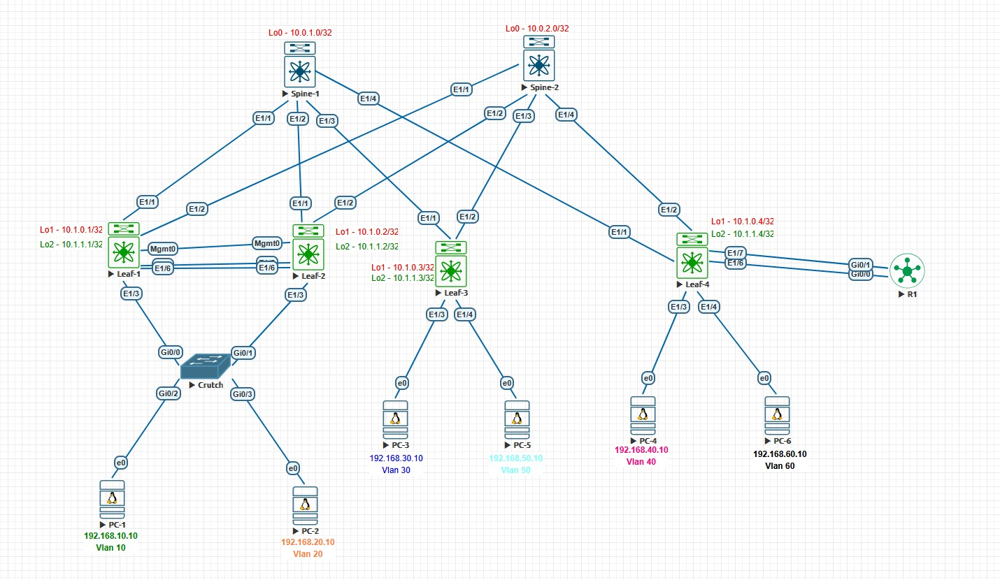

## Домашнее задание №8
### Тестовый стенд


#### Underlay и Overlay построен на iBGP AS 65000, для роутинга между vrf, к Leaf-4 подключен маршрутизатор R1 c AS65001
#### Конфигурация коммутаторов
<details>
  <summary><b> Spine-1 </b></summary>
  <p> 

  ```
nv overlay evpn
    feature ospf
    feature bgp
    feature isis
    feature bfd
    
    route-map Leaf_AS permit 10
      match as-number 65201-65299 
    vrf context management
    
    
    interface Ethernet1/1
      no switchport
      no ip redirects
      ip address 10.2.1.0/31
      no ipv6 redirects
      no shutdown
    
    interface Ethernet1/2
      no switchport
      no ip redirects
      ip address 10.2.1.2/31
      no ipv6 redirects
      no shutdown
    
    interface Ethernet1/3
      no switchport
      no ip redirects
      ip address 10.2.1.4/31
      no ipv6 redirects
      no shutdown
    
    interface Ethernet1/4
      no switchport
      no ip redirects
      ip address 10.2.1.6/31
      no ipv6 redirects
      no shutdown
  
    interface loopback0
    ip address 10.0.1.0/32
    icam monitor scale
  
    cli alias name wr copy running-config startup-config
    line console
    line vty
    boot nxos bootflash:/nxos64-cs.10.3.5.M.bin 
    router bgp 65000
      router-id 10.0.1.0
      address-family ipv4 unicast
        network 10.0.1.0/32
        maximum-paths 10
      address-family l2vpn evpn
        maximum-paths 10
        maximum-paths ibgp 64
      template peer LEAF
        remote-as 65000
        update-source loopback0
        timers 3 9
        address-family l2vpn evpn
          send-community
          send-community extended
          route-reflector-client
      template peer-policy DC
        send-community
        send-community extended
        route-reflector-client
        next-hop-self all
      template peer-session DC
        remote-as 65000
        timers 3 9
      neighbor 10.1.0.1
        inherit peer LEAF
      neighbor 10.1.0.2
        inherit peer LEAF
      neighbor 10.1.0.3
        inherit peer LEAF
      neighbor 10.1.0.4
        inherit peer LEAF
      neighbor 10.2.0.0/16
        inherit peer DC
        inherit peer-session DC
        address-family ipv4 unicast
          route-reflector-client
          next-hop-self all
```
</p>
  </details>

<details>
  <summary><b> Spine-2 </b></summary>
  <p> 

```

nv overlay evpn
feature ospf
feature bgp
feature isis

interface Ethernet1/1
  no switchport
  no ip redirects
  ip address 10.2.2.0/31
  no ipv6 redirects
  no shutdown

interface Ethernet1/2
  no switchport
  no ip redirects
  ip address 10.2.2.2/31
  no ipv6 redirects
  no shutdown

interface Ethernet1/3
  no switchport
  no ip redirects
  ip address 10.2.2.4/31
  no ipv6 redirects
  no shutdown

interface Ethernet1/4
  no switchport
  no ip redirects
  ip address 10.2.2.6/31
  no ipv6 redirects
  no shutdown

interface loopback0
  ip address 10.0.2.0/32

router bgp 65000
  router-id 10.0.2.0
  address-family ipv4 unicast
    network 10.0.2.0/32
    maximum-paths 10
  address-family l2vpn evpn
    maximum-paths 10
    maximum-paths ibgp 64
  template peer LEAF
    remote-as 65000
    update-source loopback0
    timers 3 9
    address-family l2vpn evpn
      send-community
      send-community extended
      route-reflector-client
  template peer-policy DC
    send-community
    send-community extended
    route-reflector-client
    next-hop-self all
  template peer-session DC
    remote-as 65000
    timers 3 9
  neighbor 10.1.0.1
    inherit peer LEAF
  neighbor 10.1.0.2
    inherit peer LEAF
  neighbor 10.1.0.3
    inherit peer LEAF
  neighbor 10.1.0.4
    inherit peer LEAF
  neighbor 10.2.0.0/16
    inherit peer DC
    inherit peer-session DC
    address-family ipv4 unicast
      route-reflector-client
      next-hop-self all
```
</p>
  </details>

<details>
  <summary><b> Leaf-1 </b></summary>
  <p>

```
nv overlay evpn
feature ospf
feature bgp
feature pim
feature isis
feature fabric forwarding
feature interface-vlan
feature vn-segment-vlan-based
feature lacp
feature vpc
feature bfd
feature nv overlay

fabric forwarding anycast-gateway-mac 0001.0002.0003
vlan 1,10,20,777,999
vlan 10
  name SERVICE10
  vn-segment 101010
vlan 20
  name SERVICE2
  vn-segment 10020
vlan 777
  name anycast_gw
  vn-segment 77777
vlan 999
  name native

route-map RD permit 10
  match interface loopback1 loopback2 
vrf context SERVICE
  vni 77777
  rd auto
  address-family ipv4 unicast
    route-target both auto
    route-target both auto evpn
vrf context management
vpc domain 1
  peer-switch
  role priority 1
  system-mac 00:11:00:22:00:33
  system-priority 100
  peer-keepalive destination 192.168.254.2 source 192.168.254.1
  delay restore 60
  peer-gateway
  layer3 peer-router
  auto-recovery
  fast-convergence
  ip arp synchronize


interface Vlan1
  no ip redirects
  no ipv6 redirects

interface Vlan10
  no shutdown
  vrf member SERVICE
  ip address 192.168.10.1/24
  no ipv6 redirects
  fabric forwarding mode anycast-gateway

interface Vlan20
  no shutdown
  vrf member SERVICE
  no ip redirects
  ip address 192.168.20.1/24
  no ipv6 redirects
  fabric forwarding mode anycast-gateway

interface Vlan777
  no shutdown
  vrf member SERVICE
  no ip redirects
  ip forward
  no ipv6 redirects

interface port-channel1
  description PC1
  switchport mode trunk
  switchport access vlan 10
  spanning-tree port type edge
  vpc 1

interface port-channel2
  description PC2
  switchport mode trunk
  switchport access vlan 20
  spanning-tree port type edge

interface port-channel100
  description vPC_PeerLink
  switchport mode trunk
  switchport trunk native vlan 999
  spanning-tree port type network
  vpc peer-link

interface nve1
  no shutdown
  host-reachability protocol bgp
  advertise virtual-rmac
  source-interface loopback1
  global ingress-replication protocol bgp
  member vni 10010
    ingress-replication protocol bgp
  member vni 10020
  member vni 77777 associate-vrf
  member vni 101010

interface Ethernet1/1
  no switchport
  no ip redirects
  ip address 10.2.1.1/31
  no ipv6 redirects
  no shutdown

interface Ethernet1/2
  no switchport
  no ip redirects
  ip address 10.2.2.1/31
  no ipv6 redirects
  no shutdown

interface Ethernet1/3
  description PC1
  switchport mode trunk
  switchport access vlan 10
  spanning-tree port type edge
  channel-group 1 mode active

interface Ethernet1/4
  description PC2
  switchport mode trunk
  switchport access vlan 20
  spanning-tree port type edge
  channel-group 2 mode active

interface Ethernet1/5
  description vPC_PeerLink
  switchport mode trunk
  switchport trunk native vlan 999
  channel-group 100 mode active

interface Ethernet1/6
  description vPC_PeerLink
  switchport mode trunk
  switchport trunk native vlan 999
  channel-group 100 mode active

interface mgmt0
  vrf member management
  ip address 192.168.254.1/24

interface loopback1
  ip address 10.1.0.1/32
  ip address 10.1.0.111/32 secondary

interface loopback2
  ip address 10.1.1.1/32

router bgp 65000
  router-id 10.1.0.1
  address-family ipv4 unicast
    redistribute direct route-map RD
    maximum-paths 10
    maximum-paths ibgp 64
  address-family l2vpn evpn
    maximum-paths 10
    maximum-paths ibgp 64
  template peer SPINE
    remote-as 65000
    update-source loopback1
    timers 3 9
    address-family l2vpn evpn
      send-community
      send-community extended
  template peer-policy DC
    send-community
    send-community extended
  template peer-session DC
    remote-as 65000
    timers 3 9
  neighbor 10.0.1.0
    inherit peer SPINE
  neighbor 10.0.2.0
    inherit peer SPINE
  neighbor 10.2.1.0
    inherit peer DC
    inherit peer-session DC
    address-family ipv4 unicast
      no next-hop-self
  neighbor 10.2.2.0
    inherit peer DC
    inherit peer-session DC
    address-family ipv4 unicast
      no next-hop-self
evpn
  vni 10010 l2
    rd auto
    route-target import auto
    route-target export auto

```
</p>
  </details>

<details>
  <summary><b> Leaf-2 </b></summary>
  <p>

```
nv overlay evpn
feature ospf
feature bgp
feature pim
feature isis
feature fabric forwarding
feature interface-vlan
feature vn-segment-vlan-based
feature lacp
feature vpc
feature nv overlay

fabric forwarding anycast-gateway-mac 0001.0002.0003
vlan 1,10,20,777,999
vlan 10
  name SERVICE10
  vn-segment 101010
vlan 20
  name SERVICE2
  vn-segment 10020
vlan 777
  name anycast_gw
  vn-segment 77777
vlan 999
  name native

spanning-tree vlan 1-3967 priority 28672
route-map RD permit 10
  match interface loopback1 loopback2 
vrf context SERVICE
  vni 77777
  rd auto
  address-family ipv4 unicast
    route-target both auto
    route-target both auto evpn
vrf context management
vpc domain 1
  peer-switch
  role priority 2
  system-mac 00:11:00:22:00:33
  system-priority 100
  peer-keepalive destination 192.168.254.1 source 192.168.254.2
  delay restore 60
  peer-gateway
  layer3 peer-router
  auto-recovery
  fast-convergence
  ip arp synchronize


interface Vlan1
  no ip redirects
  no ipv6 redirects

interface Vlan10
  no shutdown
  vrf member SERVICE
  no ip redirects
  ip address 192.168.10.1/24
  no ipv6 redirects
  fabric forwarding mode anycast-gateway

interface Vlan20
  no shutdown
  vrf member SERVICE
  no ip redirects
  ip address 192.168.20.1/24
  no ipv6 redirects
  fabric forwarding mode anycast-gateway

interface Vlan777
  no shutdown
  vrf member SERVICE
  no ip redirects
  ip forward
  no ipv6 redirects

interface port-channel1
  description PC1
  switchport mode trunk
  switchport access vlan 10
  spanning-tree port type edge
  vpc 1

interface port-channel2
  description PC2
  switchport mode trunk
  switchport access vlan 20
  spanning-tree port type edge

interface port-channel100
  description vPC_PeerLink
  switchport mode trunk
  switchport trunk native vlan 999
  spanning-tree port type network
  vpc peer-link

interface nve1
  no shutdown
  host-reachability protocol bgp
  advertise virtual-rmac
  source-interface loopback1
  global ingress-replication protocol bgp
  member vni 10010
  member vni 10020
  member vni 77777 associate-vrf
  member vni 101010

interface Ethernet1/1
  no switchport
  no ip redirects
  ip address 10.2.1.3/31
  no ipv6 redirects
  no shutdown

interface Ethernet1/2
  no switchport
  no ip redirects
  ip address 10.2.2.3/31
  no ipv6 redirects
  no shutdown

interface Ethernet1/3
  description PC1
  switchport mode trunk
  switchport access vlan 10
  spanning-tree port type edge
  channel-group 1 mode active

interface Ethernet1/4
  description PC2
  switchport mode trunk
  switchport access vlan 20
  spanning-tree port type edge
  channel-group 2 mode active

interface Ethernet1/5
  description vPC_PeerLink
  switchport mode trunk
  switchport trunk native vlan 999
  channel-group 100 mode active

interface Ethernet1/6
  description vPC_PeerLink
  switchport mode trunk
  switchport trunk native vlan 999
  channel-group 100 mode active

interface mgmt0
  vrf member management
  ip address 192.168.254.2/24

interface loopback1
  ip address 10.1.0.2/32
  ip address 10.1.0.111/32 secondary

interface loopback2
  ip address 10.1.1.2/32

router bgp 65000
  router-id 10.1.0.2
  address-family ipv4 unicast
    redistribute direct route-map RD
    maximum-paths 10
    maximum-paths ibgp 64
  address-family l2vpn evpn
    maximum-paths 10
    maximum-paths ibgp 64
  template peer SPINE
    remote-as 65000
    update-source loopback1
    timers 3 9
    address-family l2vpn evpn
      send-community
      send-community extended
  template peer-policy DC
    send-community
    send-community extended
  template peer-session DC
    remote-as 65000
    timers 3 9
  neighbor 10.0.1.0
    inherit peer SPINE
  neighbor 10.0.2.0
    inherit peer SPINE
  neighbor 10.2.1.2
    inherit peer DC
    inherit peer-session DC
    address-family ipv4 unicast
      no next-hop-self
  neighbor 10.2.2.2
    inherit peer DC
    inherit peer-session DC
    address-family ipv4 unicast
      no next-hop-self
evpn
  vni 10010 l2
    rd auto
    route-target import auto
    route-target export auto

```
</p>
  </details>

<details>
  <summary><b> Leaf-3 </b></summary>
  <p>
    
```
nv overlay evpn
feature ospf
feature bgp
feature isis
feature fabric forwarding
feature interface-vlan
feature vn-segment-vlan-based
feature nv overlay

fabric forwarding anycast-gateway-mac 0001.0002.0003
vlan 1,30,50,777,888
vlan 30
  name Service_3
  vn-segment 10030
vlan 50
  vn-segment 10050
vlan 777
  name anycast_gw
  vn-segment 77777
vlan 888
  vn-segment 88888

route-map REDISTRIBUTE_CONN permit 10
  match interface loopback1 loopback2 
vrf context SERVICE
  vni 77777
  rd auto
  address-family ipv4 unicast
    route-target both auto
    route-target both auto evpn
vrf context SERVICE2
  vni 88888
  rd auto
  address-family ipv4 unicast
    route-target both auto
    route-target both auto evpn
vrf context management


interface Vlan1

interface Vlan30
  no shutdown
  vrf member SERVICE
  ip address 192.168.30.1/24
  fabric forwarding mode anycast-gateway

interface Vlan50
  no shutdown
  vrf member SERVICE2
  ip address 192.168.50.1/24
  fabric forwarding mode anycast-gateway

interface Vlan777
  no shutdown
  vrf member SERVICE
  ip forward

interface Vlan888
  no shutdown
  vrf member SERVICE2
  ip forward

interface nve1
  no shutdown
  host-reachability protocol bgp
  source-interface loopback1
  global suppress-arp
  global ingress-replication protocol bgp
  member vni 10010
  member vni 10030
  member vni 10050
  member vni 77777 associate-vrf
  member vni 88888 associate-vrf

interface Ethernet1/1
  no switchport
  no ip redirects
  ip address 10.2.1.5/31
  no ipv6 redirects
  no shutdown

interface Ethernet1/2
  no switchport
  no ip redirects
  ip address 10.2.2.5/31
  no ipv6 redirects
  no shutdown

interface Ethernet1/3
  switchport access vlan 30

interface Ethernet1/4
  switchport access vlan 50

interface loopback1
  ip address 10.1.0.3/32

interface loopback2
  ip address 10.1.1.3/32

router bgp 65000
  router-id 10.1.0.3
  address-family ipv4 unicast
    redistribute direct route-map REDISTRIBUTE_CONN
    maximum-paths 10
    maximum-paths ibgp 64
  address-family l2vpn evpn
    maximum-paths 10
    maximum-paths ibgp 64
  template peer SPINE
    remote-as 65000
    update-source loopback1
    timers 3 9
    address-family l2vpn evpn
      send-community
      send-community extended
  template peer-policy DC
    send-community
    send-community extended
  template peer-session DC
    remote-as 65000
    timers 3 9
  neighbor 10.0.1.0
    inherit peer SPINE
  neighbor 10.0.2.0
    inherit peer SPINE
  neighbor 10.2.1.4
    inherit peer DC
    inherit peer-session DC
    address-family ipv4 unicast
  neighbor 10.2.2.4
    inherit peer DC
    inherit peer-session DC
    address-family ipv4 unicast
evpn
  vni 10010 l2
    rd auto
    route-target import auto
    route-target export auto
```
</p>
  </details>

<details>
  <summary><b> Leaf-4 </b></summary>
  <p>

```
nv overlay evpn
feature ospf
feature bgp
feature isis
feature fabric forwarding
feature interface-vlan
feature vn-segment-vlan-based
feature nv overlay

fabric forwarding anycast-gateway-mac 0001.0002.0003
vlan 1,40,60,111-112,777,888
vlan 40
  name SERVICE40
  vn-segment 10040
vlan 60
  vn-segment 10060
vlan 111
  name recon_SERVICE
vlan 112
  name recon_SERVICE2
vlan 777
  name anycast_gw
  vn-segment 77777
vlan 888
  vn-segment 88888

route-map PERMIT permit 10
route-map REDISTRIBUTE_CONN permit 10
  match interface loopback1 loopback2 
vrf context SERVICE
  vni 77777
  rd auto
  address-family ipv4 unicast
    route-target both auto
    route-target both auto evpn
vrf context SERVICE2
  vni 88888
  rd auto
  address-family ipv4 unicast
    route-target both auto
    route-target both auto evpn

interface Vlan40
  no shutdown
  vrf member SERVICE
  ip address 192.168.40.1/24
  fabric forwarding mode anycast-gateway

interface Vlan60
  no shutdown
  vrf member SERVICE2
  ip address 192.168.60.1/24
  fabric forwarding mode anycast-gateway

interface Vlan111
  description recon_Service
  no shutdown
  vrf member SERVICE
  ip address 10.4.0.1/30

interface Vlan112
  no shutdown
  vrf member SERVICE2
  ip address 10.4.0.5/30

interface Vlan777
  no shutdown
  vrf member SERVICE
  ip forward

interface Vlan888
  no shutdown
  vrf member SERVICE2
  ip forward

interface nve1
  no shutdown
  host-reachability protocol bgp
  source-interface loopback1
  global ingress-replication protocol bgp
  member vni 10010
    ingress-replication protocol bgp
  member vni 10040
  member vni 10060
  member vni 77777 associate-vrf
  member vni 88888 associate-vrf

interface Ethernet1/1
  no switchport
  no ip redirects
  ip address 10.2.1.7/31
  no ipv6 redirects
  no shutdown

interface Ethernet1/2
  no switchport
  no ip redirects
  ip address 10.2.2.7/31
  no ipv6 redirects
  no shutdown

interface Ethernet1/3
  switchport access vlan 40

interface Ethernet1/4
  switchport access vlan 60

interface Ethernet1/5

interface Ethernet1/6
  switchport access vlan 111

interface Ethernet1/7
  switchport access vlan 112

interface loopback1
  ip address 10.1.0.4/32

interface loopback2
  ip address 10.1.1.4/32

router bgp 65000
  router-id 10.1.0.4
  address-family ipv4 unicast
    redistribute direct route-map REDISTRIBUTE_CONN
    maximum-paths 10
    maximum-paths ibgp 64
  address-family l2vpn evpn
    maximum-paths 10
    maximum-paths ibgp 64
  template peer SPINE
    remote-as 65000
    update-source loopback1
    timers 3 9
    address-family l2vpn evpn
      send-community
      send-community extended
  template peer-policy DC
    send-community
    send-community extended
  template peer-session DC
    remote-as 65000
    timers 3 9
  neighbor 10.0.1.0
    inherit peer SPINE
  neighbor 10.0.2.0
    inherit peer SPINE
  neighbor 10.2.1.6
    inherit peer DC
    inherit peer-session DC
    address-family ipv4 unicast
  neighbor 10.2.2.6
    inherit peer DC
    inherit peer-session DC
    address-family ipv4 unicast
  vrf SERVICE
    address-family ipv4 unicast
      redistribute hmm route-map PERMIT
      redistribute direct route-map PERMIT
    neighbor 10.4.0.2
      remote-as 65001
      address-family ipv4 unicast
  vrf SERVICE2
    address-family ipv4 unicast
      redistribute hmm route-map PERMIT
      redistribute direct route-map PERMIT
    neighbor 10.4.0.6
      remote-as 65001
      address-family ipv4 unicast
evpn
  vni 10010 l2
    rd auto
    route-target import auto
    route-target export auto
```
</p>
  </details>

<details>
  <summary><b> R1 </b></summary>
  <p>
    
```
interface GigabitEthernet0/0
 ip address 10.4.0.2 255.255.255.252
 duplex auto
 speed auto
 media-type rj45
!
interface GigabitEthernet0/1
 ip address 10.4.0.6 255.255.255.252
 duplex auto
 speed auto
 media-type rj45

router bgp 65001
 bgp log-neighbor-changes
 neighbor 10.4.0.1 remote-as 65000
 neighbor 10.4.0.1 as-override
 neighbor 10.4.0.5 remote-as 65000
 neighbor 10.4.0.5 as-override

```
</p>
  </details>

