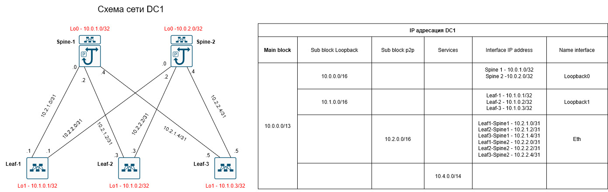
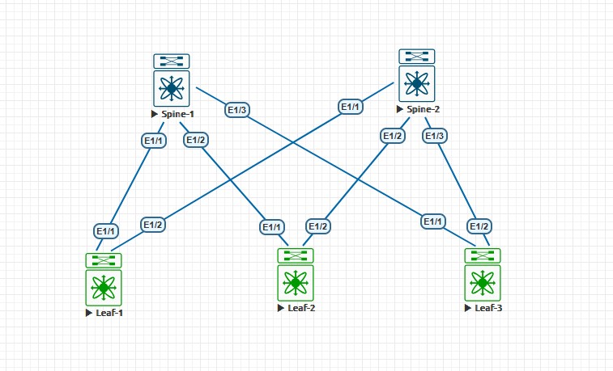
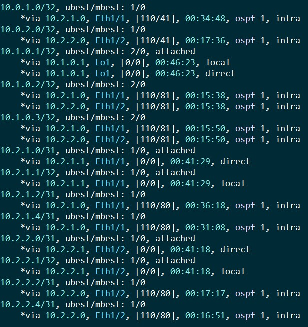
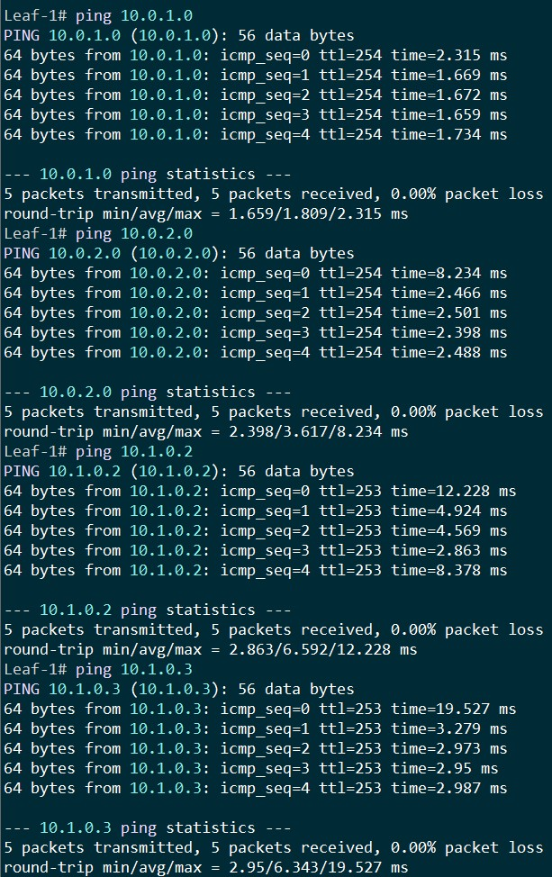

# Домашнее задание №2
### Схема и IP адресация
###### Схема и IP адресация используется из ДЗ №1

### Тестовый стенд

###### Таблица маршрутизации

###### Проверка доступности Loopback интерфейсов

